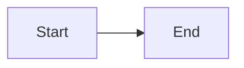

# Mermaid Diagram Rendering - Implementation & Debugging Guide

## What We Implemented

We added Mermaid diagram support to render infrastructure diagrams as interactive visualizations instead of plain text code blocks.

### Files Modified

1. **`components/mdx/mermaid.tsx`** - The Mermaid rendering component
   - Marked as `'use client'` (runs in browser)
   - Uses `mermaid.js` library to convert text to SVG
   - Has a `mounted` check to prevent SSR issues
   - Returns empty div during SSR, then renders diagram on client

2. **`app/mdx-components.tsx`** - First attempt (NOT USED)
   - Added Pre component override here
   - But this file isn't actually used by the page rendering

3. **`app/docs/[[...slug]]/page.tsx`** - **THE ACTUAL IMPLEMENTATION**
   - This is where pages are rendered
   - Added `Pre` component that intercepts code blocks
   - Added `extractText` helper to get text from React children
   - Checks if code block has `language-mermaid` class
   - If yes: passes text to `<Mermaid>` component
   - If no: uses fumadocs' default `pre` for syntax highlighting

4. **`content/docs/self-hosting/infrastructure-setup.mdx`** - The diagram
   - Added large mermaid flowchart with infrastructure architecture
   - Uses triple backtick code fence with `mermaid` language identifier

### How It Should Work

```
MDX File (```mermaid block)
    ↓
Fumadocs processes MDX
    ↓
Renders as <pre><code class="language-mermaid">text</code></pre>
    ↓
Our custom Pre component in page.tsx intercepts it
    ↓
Detects className includes "language-mermaid"
    ↓
Extracts text content
    ↓
Passes to <Mermaid chart={text} />
    ↓
Mermaid component renders SVG diagram
```

## Current Issue: Still Rendering as Text

The diagram is showing as plain text instead of rendering. Here's what to check:

### Debug Console Logs

We added console.log statements in `app/docs/[[...slug]]/page.tsx` in the `Pre` function:

```typescript
function Pre({ children, ...props }: ComponentProps<'pre'>) {
  console.log('Pre component called');  // Is this showing up?
  console.log('children:', children);    // What's the structure?
  console.log('props:', props);          // What props are passed?

  if (isValidElement(children)) {
    const childProps = children.props as { className?: string; children?: ReactNode };
    const className = childProps.className || '';

    console.log('className:', className);  // Does it have "language-mermaid"?
    console.log('includes language-mermaid?', className.includes('language-mermaid'));

    if (className.includes('language-mermaid')) {
      const chart = extractText(childProps.children);
      console.log('Rendering Mermaid chart:', chart.substring(0, 100));
      return (
        <div className="my-6" suppressHydrationWarning>
          <Mermaid chart={chart} />
        </div>
      );
    }
  }

  // ...fallback
}
```

### What to Check in Browser Console

1. **Navigate to**: `http://localhost:3000/docs/self-hosting/infrastructure-setup`
2. **Open Console**: F12 or right-click > Inspect > Console tab
3. **Look for these logs**:

#### Scenario 1: Pre component NOT called
```
(no logs at all)
```
**Problem**: The Pre component override isn't being used
**Solution**: Check that `mdxComponents` object in page.tsx has `pre: Pre`

#### Scenario 2: Pre component called but wrong className
```
Pre component called
children: {...}
props: {...}
className: "language-typescript" (or something else, NOT "language-mermaid")
includes language-mermaid? false
```
**Problem**: MDX is not generating `language-mermaid` class
**Solution**:
- Check the MDX file has exactly: ` ```mermaid ` (no typos)
- Clear Next.js cache: `rm -rf .next && pnpm dev`
- Check Fumadocs version and MDX processing

#### Scenario 3: className is correct but Mermaid doesn't render
```
Pre component called
children: {...}
props: {...}
className: "language-mermaid"
includes language-mermaid? true
Rendering Mermaid chart: flowchart TB...
```
**Problem**: Mermaid component has an error
**Solution**: Check for additional errors in console about mermaid.js

#### Scenario 4: Pre not called for mermaid blocks specifically
```
(logs show up for other code blocks but not mermaid ones)
```
**Problem**: Mermaid blocks being processed differently
**Solution**: Fumadocs might be handling mermaid specially already

### Manual Checks

#### 1. Verify MDX syntax in the file
```bash
cat content/docs/self-hosting/infrastructure-setup.mdx | grep -A 3 "^```mermaid"
```
Should show:
```
```mermaid
flowchart TB
    subgraph Internet
```

#### 2. Check if Pre is in mdxComponents
```bash
grep -A 5 "const mdxComponents" app/docs/\[\[\...slug\]\]/page.tsx | grep "pre:"
```
Should show:
```typescript
    pre: Pre,
```

#### 3. Check Mermaid component exists
```bash
ls -la components/mdx/mermaid.tsx
```

#### 4. Check mermaid package installed
```bash
grep "mermaid" package.json
```
Should show:
```json
"mermaid": "11.12.2"
```

### Alternative: Check Fumadocs Configuration

Fumadocs might have built-in mermaid support that we need to enable instead:

```bash
# Check source config
cat lib/source.ts | grep -i mermaid

# Check if fumadocs-mdx has mermaid support
grep -r "mermaid" node_modules/fumadocs-mdx/dist/ 2>/dev/null | head -5
```

### Test with Simple Example

Create a test file to isolate the issue:

**File**: `content/docs/test-mermaid.mdx`
```mdx
---
title: Mermaid Test
description: Testing mermaid rendering
---

# Test Mermaid

Simple diagram:



Regular code:

```javascript
console.log('test');
```
```

Navigate to `/docs/test-mermaid` and check if:
1. The JavaScript code block renders with syntax highlighting (confirms Pre works for non-mermaid)
2. The mermaid block shows console logs (confirms Pre is called for mermaid)
3. The mermaid renders as diagram or text

## Possible Root Causes

### 1. MDX Processing Issue
Fumadocs might not be passing through the raw mermaid text. It might be pre-processing it.

**Check**: Look at what `children` contains in the console log

### 2. Component Not Client-Side
If Mermaid component doesn't have `'use client'`, it won't work.

**Verify**: First line of `components/mdx/mermaid.tsx` should be `'use client';`

### 3. Mermaid Library Error
The mermaid.js library might be failing to initialize or render.

**Check**: Look for errors in console about mermaid initialization

### 4. Pre Component Override Not Applied
The mdxComponents object might not include our Pre override.

**Verify**: Check line ~99 in `app/docs/[[...slug]]/page.tsx`:
```typescript
const mdxComponents = {
  ...defaultMdxComponents,
  ...((await import('lucide-react')) as unknown as MDXComponents),
  pre: Pre,  // <-- This line must be here
  // ...
```

### 5. Fumadocs Has Its Own Mermaid Handler
Fumadocs might already have mermaid support that conflicts with ours.

**Solution**: Check Fumadocs docs or disable their handler

## Next Steps for Debugging

1. **First**: Check browser console logs on the infrastructure-setup page
2. **Second**: Based on logs, identify which scenario above matches
3. **Third**: Try the test-mermaid.mdx file to isolate the issue
4. **Fourth**: If Pre is never called, check if fumadocs-mdx has built-in mermaid
5. **Fifth**: If Pre IS called but mermaid doesn't render, check Mermaid component errors

## Contact Points

If you find the issue, update this file with the solution!

**Files to focus on**:
- `app/docs/[[...slug]]/page.tsx` - Pre component logic
- `components/mdx/mermaid.tsx` - Mermaid rendering
- Browser console - Debug logs
- `content/docs/self-hosting/infrastructure-setup.mdx` - The actual diagram

**Current Status**: Mermaid diagrams render as plain text instead of interactive SVG
