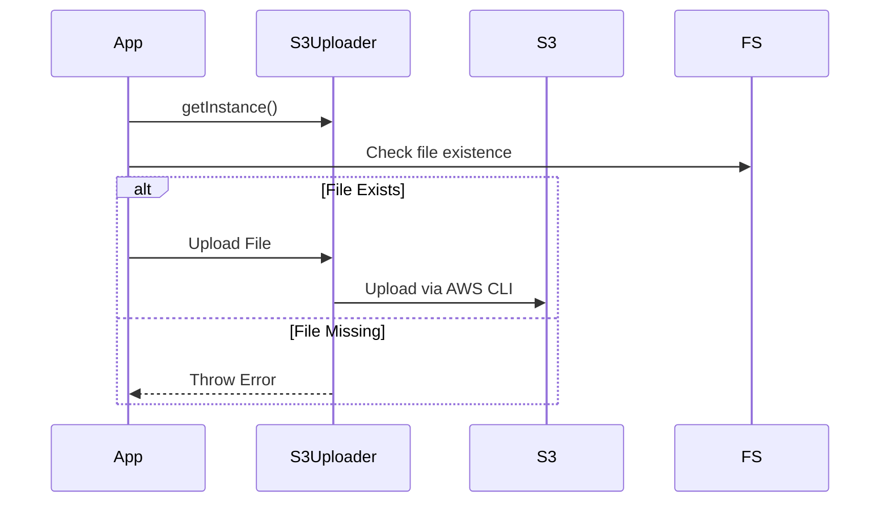

# 🐟 API Updates - April 23, 2025

<Callout type="info">
Dive into the latest updates for our Meeting Bass API! 🎣 Just like a skilled angler, we've been refining our code to catch the best performance.
</Callout>

## Key Changes

### S3 Uploader Singleton Refactoring

<Steps>
<Step>Implemented singleton pattern for `S3Uploader`</Step>
<Step>Enhanced error handling and file existence checks</Step>
<Step>Consolidated S3 utility functions</Step>
</Steps>

### Logging Improvements

<Tabs items={['Before', 'After']}>
<Tab value="Before">
- Separate S3 utility files
- Limited error handling
</Tab>
<Tab value="After">
- Centralized S3 upload management
- Robust error logging
- Automatic crash log uploads
</Tab>
</Tabs>

### File Changes

<Files>
<Folder name="meeting_bot/recording_server/src" defaultOpen>
    <Folder name="utils">
        <File name="S3Uploader.ts" />
        <File name="pinoLogger.ts" />
        <File name="takeScreenshot.ts" />
    </Folder>
    <Folder name="recording">
        <File name="AudioExtractor.ts" />
        <File name="Transcoder.ts" />
    </Folder>
    <File name="main.ts" />
</Folder>
</Files>

### Sequence of Changes

### Improvements Highlights

<TypeTable 
    type={{
        singletonPattern: {
            description: 'Ensures single S3Uploader instance',
            type: 'Design Pattern',
            default: 'Multiple instances'
        },
        errorHandling: {
            description: 'Enhanced error detection and logging',
            type: 'Robustness',
            default: 'Basic error handling'
        }
    }}
/>