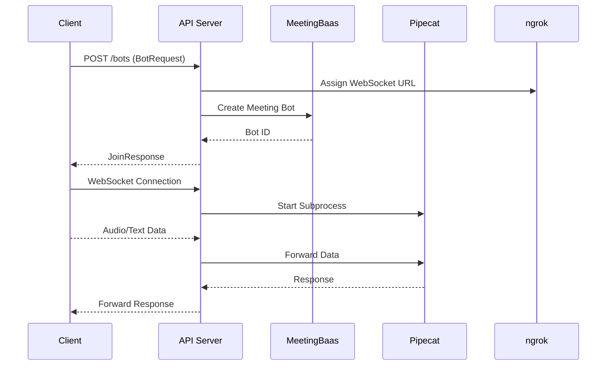

🐟 Hooked on APIs: Where Every Endpoint is a Catch! 🎣

# Speaking Bots Service Updates - April 15, 2025

<Callout type="info">
  This update introduces a comprehensive API-first architecture for managing speaking meeting bots, replacing previous CLI and subprocess-based approaches.
</Callout>

## Key Highlights

### 🚀 New Architecture
- Introduced FastAPI server with robust HTTP and WebSocket endpoints
- Implemented modular, asynchronous bot lifecycle management
- Added ngrok integration for local development

### 🛠 Core Improvements
- Enhanced persona management
- Improved error handling and logging
- Streamlined deployment configurations

## Major Changes

<Tabs items={['API', 'WebSockets', 'Deployment']}>
  <Tab value="API">
    - Created typed Pydantic models for bot requests and responses
    - Implemented comprehensive API endpoints for bot creation and management
    - Added OpenAPI schema documentation
  </Tab>
  <Tab value="WebSockets">
    - Developed real-time audio streaming via WebSocket
    - Implemented connection management utilities
    - Added robust error handling for WebSocket communications
  </Tab>
  <Tab value="Deployment">
    - Updated Dockerfile for modern Python runtime
    - Added Fly.io deployment configuration
    - Improved environment variable management
  </Tab>
</Tabs>

## Code Structure Transformation

<Files>
  <Folder name="app" defaultOpen>
    <File name="main.py" />
    <File name="routes.py" />
    <File name="websockets.py" />
  </Folder>
  <Folder name="core">
    <File name="process.py" />
    <File name="connection.py" />
    <File name="router.py" />
  </Folder>
  <Folder name="utils">
    <File name="ngrok.py" />
    <File name="process.py" />
  </Folder>
</Files>

## Sequence of Bot Lifecycle

## Breaking Changes

<Callout type="warn">
  - Removed legacy CLI and subprocess-based bot management
  - Replaced old bot creation methods with new API-driven approach
  - Requires updated client implementations to use new API endpoints
</Callout>

## Migration Guide

<Steps>
  <Step>Update client libraries to use new FastAPI endpoints</Step>
  <Step>Replace subprocess management with API calls</Step>
  <Step>Implement WebSocket communication according to new protocol</Step>
  <Step>Update environment configurations</Step>
</Steps>

## Future Roadmap

- Enhanced AI persona management
- More granular bot control interfaces
- Improved real-time communication protocols

<Callout type="info">
  Swim upstream with our new API architecture! 🐟
</Callout>