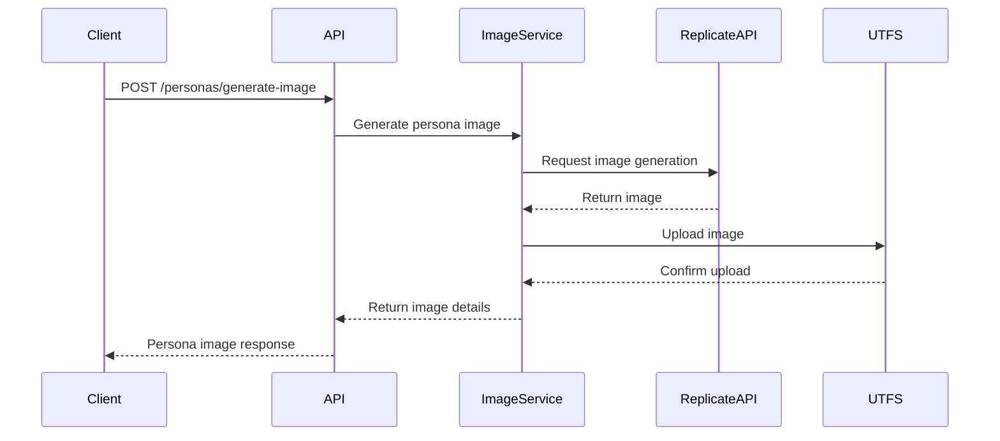

# 🐟 Speaking Bots: Persona Image Generation Update

<Callout type="info">
Dive into our latest feature that brings personas to life with AI-generated images! 🎨
</Callout>

## New Feature: Persona Image Generation API

### Key Improvements

<Steps>
<Step>Added new endpoint for generating persona images</Step>
<Step>Implemented robust image generation service</Step>
<Step>Enhanced error handling and response structures</Step>
</Steps>

### Technical Details

<Tabs items={['Models', 'Routes', 'Image Service']}>
<Tab value="Models">
- Added `PersonaImageRequest` model
- Created `PersonaImageResponse` model
- Supports detailed persona description inputs
</Tab>

<Tab value="Routes">
- New POST endpoint: `/personas/generate-image`
- Accepts persona details like name, gender, description
- Returns generated image URL and metadata
</Tab>

<Tab value="Image Service">
- Integrates with Replicate AI for image generation
- Uploads generated images to UTFS
- Handles various image generation scenarios
</Tab>
</Tabs>

### Example Request

```python
# Generate a persona image
request = PersonaImageRequest(
    name="Alex Johnson",
    gender="neutral",
    description="A creative software engineer",
    characteristics=["glasses", "professional attire"]
)
```

### Sequence of Image Generation



<Callout type="warn">
⚠️ Beta Feature: Image generation may have occasional variations in output quality.
</Callout>