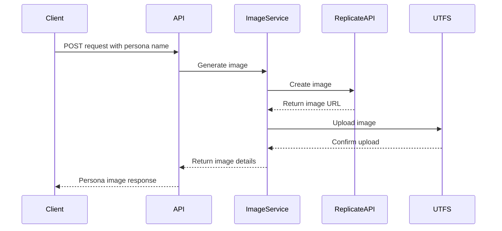

🐟 Dive into the latest waves of our persona image generation feature! We're making image creation as smooth as a bass gliding through water. 🐟

## Key Updates

### Image Generation Improvements

<Steps>
  <Step>Enhanced persona image generation with more precise name-based prompts</Step>
  <Step>Improved image creation workflow</Step>
  <Step>Refined error handling and image upload process</Step>
</Steps>

### Major Changes

<Tabs items={['Models', 'Routes', 'Services']}>
  <Tab value="Models">

- Removed `prompt` field from `PersonaImageResponse`
- Added `name` field to response model

  </Tab>
  <Tab value="Routes">

- Updated `generate_persona_image` endpoint
- Improved prompt construction
- Refined image generation parameters

  </Tab>
  <Tab value="Services">

- Added new `generate_persona_image` method
- Implemented robust image generation logic
- Enhanced error handling

  </Tab>
</Tabs>

<Callout type="warn">
  Image generation now focuses on creating persona-specific images using the persona's name as a key input.
</Callout>

#### Image Generation Workflow

### Improvements Breakdown

<TypeTable 
  type={{
    "Image Generation": {
      description: "More precise persona-specific image creation",
      type: "Enhanced Algorithm",
      impact: "High"
    },
    "Prompt Construction": {
      description: "Uses persona name for more accurate results",
      type: "String Transformation",
      impact: "Medium"
    },
    "Error Handling": {
      description: "Improved robustness in image generation process",
      type: "Error Management",
      impact: "High"
    }
  }}
/>

<Callout type="info">
  Swim smoothly through our updated image generation feature - making persona images as unique as each fish in the sea! 🐟
</Callout>