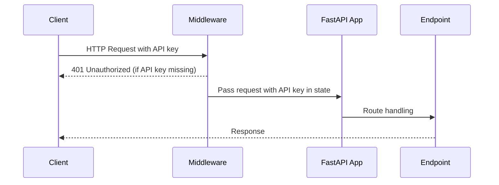

# Speaking Bots Service Update 🐟

<Callout type="info">
  Hooked on API security? We've just reeled in a robust authentication mechanism! 🎣
</Callout>

## Authentication Enhancements

### Key Changes

- **API Key Authentication**: Implemented middleware-based authentication
- **Security Improvements**: 
  - Added API key header requirement
  - Excluded documentation endpoints from authentication
  - Centralized API key handling

### Technical Details

<Tabs items={['Authentication', 'OpenAPI Schema', 'Endpoint Updates']}>
  <Tab value="Authentication">
    - Middleware checks for `x-meeting-baas-api-key` header
    - Stores API key in request state for downstream use
    - Provides consistent authentication across endpoints
  </Tab>
  <Tab value="OpenAPI Schema">
    - Extended OpenAPI documentation
    - Added security scheme
    - Updated schema for persona image generation
  </Tab>
  <Tab value="Endpoint Updates">
    - Removed API key fields from request models
    - Updated endpoint logic to use middleware-based authentication
    - Improved API key retrieval process
  </Tab>
</Tabs>

### Key Files Modified

<Files>
  <Folder name="app" defaultOpen>
    <File name="main.py" />
    <File name="models.py" />
    <File name="routes.py" />
  </Folder>
</Files>

### Sequence of Authentication Flow

<Callout type="warn">
  Breaking Change: API key must now be passed in the `x-meeting-baas-api-key` header
</Callout>