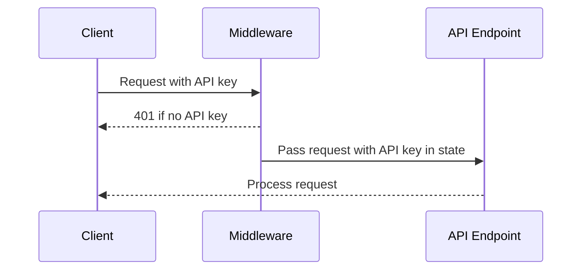

🐟 Speaking Bots Service Update

<Callout type="info">
Hooked on security? We just reeled in some serious API authentication improvements! 🎣
</Callout>

## Key Authentication Enhancements

### API Key Security Upgrade

The latest update introduces centralized API key authentication with the following improvements:

<Steps>
  <Step>Enforced API key authentication for all endpoints</Step>
  <Step>Implemented middleware-based authentication</Step>
  <Step>Enhanced OpenAPI documentation</Step>
</Steps>

### Major Changes

<Tabs items={['Authentication', 'Documentation', 'Code Structure']}>
  <Tab value="Authentication">
    - Added `x-meeting-baas-api-key` header requirement
    - Centralized API key retrieval from request headers
    - Middleware checks API key for non-documentation endpoints
  </Tab>
  <Tab value="Documentation">
    - Extended OpenAPI schema with security definitions
    - Added detailed schemas for persona image generation
    - Updated health check endpoint metadata
  </Tab>
  <Tab value="Code Structure">
    - Removed API key fields from request models
    - Updated endpoint logic to use middleware-based authentication
    - Improved request state management
  </Tab>
</Tabs>

### Code Refactoring Highlights

<Accordions>
  <Accordion title="API Key Middleware" value="middleware">

```python
# Centralized API key authentication middleware
async def api_key_middleware(request: Request, call_next):
    # Exclude documentation routes
    if request.url.path.startswith("/docs"):
        return await call_next(request)

    # Check for API key in headers
    api_key = request.headers.get("x-meeting-baas-api-key")
    if not api_key:
        raise HTTPException(status_code=401, detail="API key required")

    # Store API key in request state
    request.state.api_key = api_key
    return await call_next(request)
```

  </Accordion>
</Accordions>

<Callout type="warn">
Breaking Change: All API requests now require the `x-meeting-baas-api-key` header
</Callout>

### Sequence of Authentication Flow

