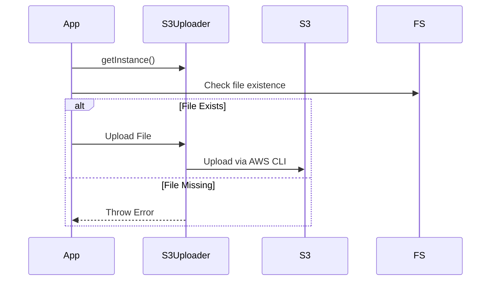
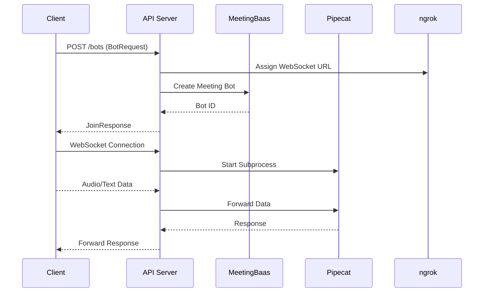
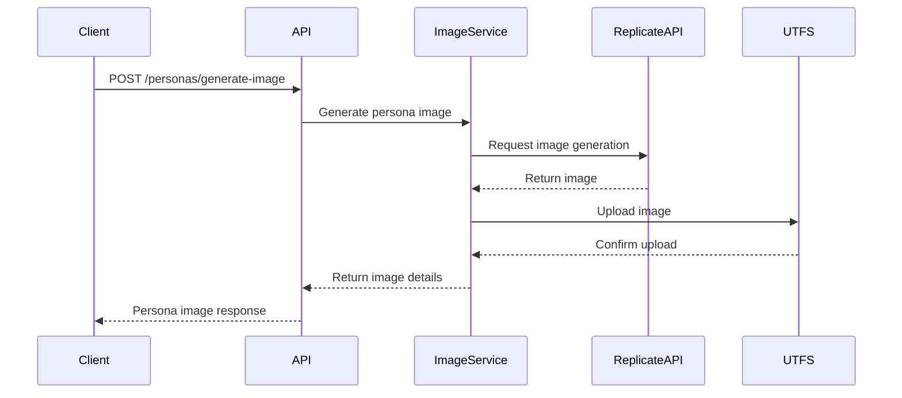
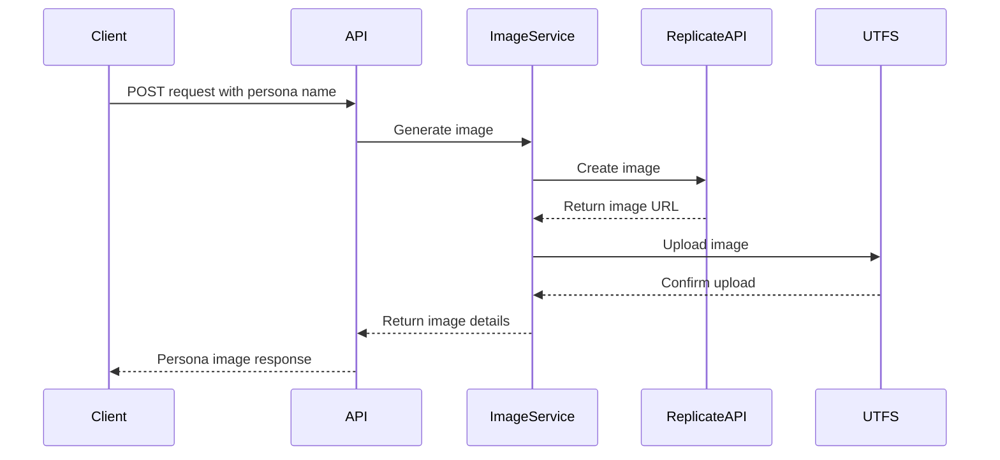
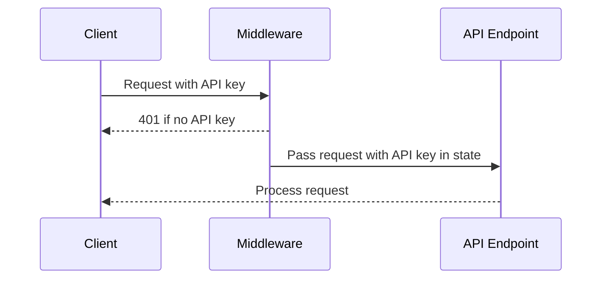

# updates Documentation

Documentation for updates.

## December 12, 2024

API - New webhooks, events, and pagination updates

### Source: ./content/docs/updates/api-2024-12-12.mdx


# 🐟 API Updates - Calendar API Update

<Callout type="info" icon={<Info className="h-5 w-5" />}>
  Paris, the 12th of December 2024.
</Callout>

We're excited to announce several improvements to our Calendar API endpoints. These changes include new features and some breaking changes.

## New Features

### Webhook Configuration Flexibility

- The `webhook_url` parameter is now optional on [`POST /calendar`](/docs/api/reference/calendars/create_calendar) endpoint if a webhook URL is already configured on the account

### Enhanced Event Information

- [`GET /calendar_events`](/docs/api/reference/calendars/list_events) now includes attendees information for each event
- [`GET /calendar_events/uuid`](/docs/api/reference/calendars/get_event) now returns the `calendar_id` of the event

### Recurring Events Bot Management

- New query parameter `all_occurrences` added to [`POST /calendar_events/uuid/bot`](/docs/api/reference/calendars/schedule_record_event)
- Allows scheduling a bot for all instances of a recurring event
- Same functionality added to [`DELETE /calendar_events/uuid/bot`](/docs/api/reference/calendars/unschedule_record_event)
- Enables bot removal from all occurrences of a recurring event

## Breaking Changes

<Callout type="warn">
### Bot Management Response Format

- [`POST /calendar_events/uuid/bot`](/docs/api/reference/calendars/schedule_record_event) now returns an array of events instead of a single event
- [`DELETE /calendar_events/uuid/bot`](/docs/api/reference/calendars/unschedule_record_event) now returns an array of events instead of a single event

</Callout>

<Callout type="warn">
### Pagination Changes
- [`GET /calendar_events`](/docs/api/reference/list_events) endpoint no longer supports `offset/limit` pagination
- Implemented cursor-based pagination
- Response format changed to include a `next` field for fetching subsequent events
- Events are returned in batches of 100
- Example response structure:
  ````json
  {
    "events": [...],
    "next": "cursor_token_for_next_page"
  }
  ````
</Callout>
## Migration Guide

1. Update your pagination implementation to use the new cursor-based system
2. Modify your bot management logic to handle arrays of events instead of single events
3. Review any webhook configuration logic to take advantage of the new optional webhook_url parameter

## Implementation Timeline

These changes are now live in production.


---

## January 04, 2025

API - New streaming formats, WebSocket configurations, and client improvements

### Source: ./content/docs/updates/api-2025-01-04.mdx


# 🐟 API Updates - Streaming and Client Updates

<Callout type="info" icon={<Info className="h-5 w-5" />}>
  Paris, the 4th of January 2025.
</Callout>

We're excited to announce several improvements to our streaming API and client applications for Zoom, Microsoft Teams, and Google Meet. These updates enhance stability, performance, and functionality.

## New Features

### Streaming Format Specification

- You can now specify the streaming format for WebSocket streams, 16kHz or 24kHz.
- **audio_frequency**: The audio frequency for the WebSocket streams, defaults to 24kHz. Can be one of `16khz` or `24khz`.

### Microsoft Teams Client Update

- We've updated our Microsoft Teams client, reducing the number of bugs by 50%.
- Now supports live Teams links, including Microsoft Live Meeting URLs (e.g., `https://teams.live.com/meet/...`).

### Google Meet Client Update

- We've updated our Google Meet client, reducing the number of bugs by 10%.

### Zoom Client Update

- Released an entirely new Zoom client. Currently, video capture isn't supported, but we plan to release this feature within the next two weeks.
- Zoom is expected to be our most stable client.

## Implementation Timeline

These changes are now live in production.


---

## February 27, 2025

API - Teams/GMeet stability improvements and new transcription capabilities

### Source: ./content/docs/updates/api-2025-02-27.mdx


# 🐟 API Updates - Improvements & Retranscribe Route

<Callout type="info" icon={<Info className="h-5 w-5" />}>
  **Paris**, the 27th of February 2025.
</Callout>

We're excited to announce significant improvements to our platform stability and the introduction of new API capabilities.

## Platform Stability Improvements

### Teams & Google Meet Enhancement

- Complete engine rewrite for both Teams and Google Meet platforms
- Migrated from Puppeteer to Playwright for improved stability
- Significantly enhanced performance and reliability
- Successfully tested with extended runtime (15+ hours) showing excellent stability

## New API Features

### New Retranscribe Endpoint

- Introduced new [`POST /bots/retranscribe`](/docs/api/reference/retranscribe_bot) endpoint
- Allows transcription or retranscription of a bot's audio
- Supports both default and custom speech-to-text providers
- Flexible webhook configuration for processing notifications

### OCR Capabilities

- Added Optical Character Recognition (OCR) inside bots for better detection of current meeting status
- This will enable future features including:
  - Sharing screenshots of meeting content
  - OCR'ed content shared in meetings (for RAG and other AI-enhanced applications)
- Improves bot awareness of visual meeting context

### Join Endpoint Enhancement

- Added `audio_only` parameter to [`POST /bots`](/docs/api/reference/join) endpoint
- Enables audio-only participation in meetings
- Optimized for scenarios requiring only audio capabilities

## Implementation Details

### Retranscribe API

The new retranscribe endpoint accepts the following parameters:

- `bot_uuid`: Identifier for the target bot
- `provider`: Choice of speech-to-text provider
- `webhook_url`: Optional callback URL for completion notifications

<Callout type="info">
  The retranscribe feature is particularly useful for:
  - Improving existing transcriptions
  
  - Using different speech-to-text providers

- Recovering from any transcription issues

</Callout>

## Future Enhancements

We're actively working on expanding the capabilities of the retranscribe endpoint:

- Additional speech-to-text providers will be supported in upcoming releases
- Custom provider parameters will be exposed through a flexible JSON configuration field
- This will enable fine-tuned control over transcription settings and provider-specific features

## Migration Guide

No breaking changes were introduced with these updates. All new features are additive and backward compatible with existing implementations.

## Implementation Timeline

These changes are now live in production and available for immediate use.


---

## March 1, 2025

API - Improved filtering, comprehensive event details, and calendar management

### Source: ./content/docs/updates/api-2025-03-01.mdx


# 🐟 API Updates - Calendar API Enhancements

<Callout type="info" icon={<Info className="h-5 w-5" />}>
  Paris, the 1st of March 2025.
</Callout>

We've expanded our Calendar API with new filtering capabilities and improved calendar management. These enhancements provide more flexibility when working with calendar events and integrations.

## New Features

### Enhanced Event Filtering

The [`GET /calendar_events`](/docs/api/reference/calendars/list_events) endpoint now supports additional filtering parameters:

- `attendeeEmail` - Filter events by attendee email address
- `organizerEmail` - Filter events by organizer email address
- `startDateGte` - Filter events with start date greater than or equal to timestamp
- `startDateLte` - Filter events with start date less than or equal to timestamp
- `status` - Filter by meeting status (`upcoming`, `past`, or `all`)

### Improved Attendee Information

The `Attendee` object now includes a `name` field that provides the display name of the attendee when available from the calendar provider (Google, Microsoft).

## Migration Guide

1. Update your API clients to take advantage of the new filtering parameters

## Related Updates

- [Calendar API Update](/docs/api/updates/calendar-api-update) - Previous calendar API enhancements
- [Retranscribe Route](/docs/api/updates/retranscribe-route) - Information about the retranscribe endpoint


---

## March 2, 2025

API - Automatically generated documentation based on Git activity.

### Source: ./content/docs/updates/api-2025-03-02.mdx


# API Updates 🐟

<Callout type="info">
  Dive into the latest updates - we're casting a wide net of improvements! 🎣
</Callout>

## March 2, 2025 Release

### Key Updates

<Steps>
  <Step>Calendar Integration Enhancements</Step>
  <Step>Security and Performance Improvements</Step>
  <Step>Code Quality Refinements</Step>
</Steps>

### Highlights

<Accordions>
  <Accordion title="Calendar Improvements" value="calendar-updates">
    Enhanced event filtering, improved attendee information management, and more robust credential handling.
  </Accordion>
  <Accordion title="Security Enhancements" value="security-updates">
    Addressed potential SQL injection vulnerabilities and improved overall system security.
  </Accordion>
</Accordions>

### Development Focus

<TypeTable 
  type={{
    calendarFiltering: {
      description: 'Improved security and maintainability of calendar event queries',
      type: 'enhancement',
      impact: 'High'
    },
    credentialManagement: {
      description: 'Preserved UUID during credential updates',
      type: 'bugfix',
      impact: 'Medium'
    }
  }}
/>

<Callout type="warn">
  Note: Internal updates that do not directly impact external API specifications.
</Callout>

---

## March 3, 2025

API - Automatically generated documentation based on Git activity.

### Source: ./content/docs/updates/api-2025-03-03.mdx


# API Updates 🐟

<Callout type="info">
  Diving into the latest updates like a bass swimming through code currents! 🎣
</Callout>

## March 3, 2025 Updates

### Key Changes

<Tabs items={['Fix Insufficient Tokens', 'Playwright Improvements']}>
  <Tab value="Fix Insufficient Tokens">
    <Steps>
      <Step>Addressed email cooldown check account filtering</Step>
      <Step>Improved token management mechanisms</Step>
    </Steps>
  </Tab>
  <Tab value="Playwright Improvements">
    <Steps>
      <Step>Enhanced streaming service integration</Step>
      <Step>Improved AWS instance management</Step>
      <Step>Updated transcription provider settings</Step>
    </Steps>
  </Tab>
</Tabs>

### Notable Modifications

<Accordions>
  <Accordion title="Token and Email Handling" value="token-management">
    Fixed issues related to insufficient token detection and email cooldown checks.
  </Accordion>
  <Accordion title="Streaming and Service Enhancements" value="streaming-improvements">
    Refined streaming service, improved error handling, and updated instance management processes.
  </Accordion>
</Accordions>

<Callout type="warn">
  Internal updates that do not directly impact external API specifications.
</Callout>

### Quick Highlights

- 🔧 Improved email cooldown filtering
- 🚀 Enhanced streaming service reliability
- ⏱️ Added timeout mechanisms for instance management
- 🔍 Refined error handling and detection processes

---

## March 4, 2025

API - Automatically generated documentation based on Git activity.

### Source: ./content/docs/updates/api-2025-03-04.mdx


# API Updates 🐟

<Callout type="info">
  Hooked on the latest API improvements? Let's dive into the updates! 🎣
</Callout>

## Overview

### Key Changes

<Tabs items={['Summary', 'Technical Details']}>
  <Tab value="Summary">
    - Minor documentation improvements
    - Internal wording refinements
  </Tab>
  <Tab value="Technical Details">
    <Files>
      <Folder name="api_server">
        <Folder name="baas_engine">
          <Folder name="src">
            <Folder name="tokens">
              <File name="constants.rs" />
            </Folder>
          </Folder>
        </Folder>
      </Folder>
    </Files>
  </Tab>
</Tabs>

## Commit Details

<Accordions>
  <Accordion title="Commit Overview" value="commit-info">
    Documentation wording improvement merged into master branch
  </Accordion>
</Accordions>

<Callout type="warn">
  Note: Specific code changes are not disclosed for confidentiality reasons.
</Callout>

## Additional Information

<Steps>
  <Step>Review completed</Step>
  <Step>Documentation refined</Step>
  <Step>Merge request processed</Step>
</Steps>

---

## March 5, 2025

API - Automatically generated documentation based on Git activity.

### Source: ./content/docs/updates/api-2025-03-05.mdx


# 🐟 Production Updates 🐟

<Callout type="info">
Diving into our latest internal API improvements - making waves in the development sea! 🌊
</Callout>

## March 5, 2025 Updates

### Key Changes

The recent updates focus on internal improvements across several core API components:

<Accordions>
  <Accordion title="Calendar Module Updates" value="calendar">
    Refinements in calendar data retrieval and event handling processes.
  </Accordion>

  <Accordion title="Bot Service Enhancements" value="bots">
    Improvements in bot-related error handling and public interfaces.
  </Accordion>
</Accordions>

### Affected Components

<Files>
  <Folder name="api_server">
    <Folder name="baas_engine">
      <File name="calendar/data/get.rs" />
      <File name="bots/error.rs" />
      <File name="bots/data/post.rs" />
    </Folder>
    <Folder name="baas_handler">
      <File name="calendar/public/calendar_events.rs" />
      <File name="bots/public.rs" />
    </Folder>
  </Folder>
</Files>

### Implementation Notes

<Callout type="warn">
These updates are internal improvements and do not directly impact external API contracts.
</Callout>

### Merge Request Details

Multiple merge requests were processed:

- MR !165: Documentation wording improvements
- MR !164: Additional documentation refinements 
- MR !163: Default token adjustments

<TypeTable
  type={{
    documentationScope: {
      description: 'Internal improvements and wording updates',
      type: 'string',
      default: 'N/A'
    },
    mergeCount: {
      description: 'Number of merge requests processed',
      type: 'number',
      default: '3'
    }
  }}
/>

---

## March 6, 2025

API - Automatically generated documentation based on Git activity.

### Source: ./content/docs/updates/api-2025-03-06.mdx


🐟 Hooked on API Updates? Let's dive into the latest catch! 

# Production Updates - March 6, 2025

<Callout type="info">
  Internal service improvements and refinements
</Callout>

## Key Changes

### Calendar and Filtering Improvements

The recent updates focus on two primary areas:

1. **Organizer Calendar Filtering**
   - Enhanced filtering mechanisms for calendar management
   - Improved data handling and retrieval processes

2. **Data Naming Conventions**
   - Transitioned to snake_case for calendar-related data structures
   - Standardized naming conventions across services

## Affected Components

<Files>
  <Folder name="meeting_bot">
    <Folder name="recording_server">
      <File name="browser.ts" />
      <Folder name="state-machine">
        <Folder name="states">
          <File name="error-state.ts" />
          <File name="initialization-state.ts" />
          <File name="recording-state.ts" />
        </Folder>
      </Folder>
    </Folder>
  </Folder>
  <Folder name="api_server">
    <Folder name="baas_engine">
      <File name="calendar/data/get.rs" />
    </Folder>
  </Folder>
</Files>

<Callout type="warn">
  These updates are internal and do not directly impact external API interfaces.
</Callout>

---

## March 10, 2025

API - Automatically generated documentation based on Git activity.

### Source: ./content/docs/updates/api-2025-03-10.mdx


🐟 Hooked on Updates: Diving into the Latest API Changes! 🐟

<Callout type="info">
  Internal Service Updates - March 10, 2025
</Callout>

## Key Changes

This update focuses on improvements to our internal service infrastructure, with modifications spanning multiple components:

### Calendar and Webhook Enhancements

<Tabs items={['API Server', 'Meeting Bot']}>
  <Tab value="API Server">
    - Updated calendar data retrieval mechanisms
    - Improved distributed caching strategies
    - Enhanced webhook processing
  </Tab>
  <Tab value="Meeting Bot">
    - Refined browser initialization and recording state management
    - Updated RabbitMQ integration
    - Improved error handling in state machines
  </Tab>
</Tabs>

### Focus Areas

<Accordions>
  <Accordion title="Calendar Operations" value="calendar-ops">
    - Refined data fetching methods
    - Internal and public calendar API adjustments
    - Added test coverage for calendar functionality
  </Accordion>
  
  <Accordion title="Recording Infrastructure" value="recording-infra">
    - State machine improvements
    - Browser setup error management
    - Enhanced recording state transitions
  </Accordion>
</Accordions>

<Callout type="warn">
  These updates are internal improvements and do not directly impact external API contracts.
</Callout>

---

## March 11, 2025

API - Automatically generated documentation based on Git activity.

### Source: ./content/docs/updates/api-2025-03-11.mdx


# API Updates 🐟

<Callout type="info">
  Dive into the latest updates for our API service - we're making waves in backend improvements! 🌊
</Callout>

## Overview of Changes

This update focuses on improving browser setup and error handling across multiple components of our API and recording infrastructure.

### Key Improvements

<Steps>
  <Step>Enhanced browser setup reliability</Step>
  <Step>Improved error state management</Step>
  <Step>Refined calendar and webhook handling</Step>
</Steps>

### Affected Components

<Files>
  <Folder name="api_server">
    <Folder name="baas_engine">
      <File name="calendar/data/get.rs" />
      <File name="calendar/error.rs" />
      <File name="extend_axum/distributed_cache.rs" />
      <File name="webhook.rs" />
    </Folder>
    <Folder name="baas_handler">
      <File name="calendar/api.rs" />
      <File name="calendar/internal.rs" />
      <File name="calendar/public/calendars.rs" />
      <File name="tests/calendar.rs" />
    </Folder>
  </Folder>
  <Folder name="meeting_bot/recording_server">
    <Folder name="src">
      <Folder name="state-machine/states">
        <File name="error-state.ts" />
        <File name="initialization-state.ts" />
        <File name="recording-state.ts" />
      </Folder>
      <File name="browser.ts" />
      <File name="main.ts" />
      <File name="rabbitmq.ts" />
    </Folder>
  </Folder>
</Files>

### Potential Impact

<Callout type="warn">
  These changes may affect browser initialization and error handling in the recording infrastructure.
</Callout>

### Recommendations

- Review browser setup processes
- Test error state transitions
- Verify calendar and webhook integrations

<Tabs items={['Production', 'Development']}>
  <Tab value="Production">
    Recommended to update in a staged rollout
  </Tab>
  <Tab value="Development">
    Immediate testing recommended
  </Tab>
</Tabs>

---

## March 12, 2025

API - Automatically generated documentation based on Git activity.

### Source: ./content/docs/updates/api-2025-03-12.mdx


# API Updates - March 12, 2025 🐟

<Callout type="info">
  Hooked on our latest API improvements? Let's dive into the details! 🎣
</Callout>

## Key Updates

### Data Deletion Endpoint 

<Tabs items={['Feature', 'Protection']}>
  <Tab value="Feature">
    - New `/:uuid/delete_data` endpoint for deleting transcription data
    - Selective deletion preserves essential metadata
    - Detailed status reporting on deletion process
  </Tab>
  <Tab value="Protection">
    - Rate limiting: 5 requests per minute per API key
    - Enhanced rate limit headers:
      - `X-RateLimit-Limit`
      - `X-RateLimit-Remaining`
      - `X-RateLimit-Reset`
  </Tab>
</Tabs>

### Calendar Sync Improvements

<Steps>
  <Step>Added tracking for affected event UUIDs in calendar webhooks</Step>
  <Step>Improved borrowing and code verbosity in sync logic</Step>
  <Step>Preserved event metadata during synchronization</Step>
</Steps>

## Technical Highlights

<Callout type="warn">
  These updates enhance data management and API reliability while maintaining user privacy and system performance.
</Callout>

<TypeTable 
  type={{
    deleteDataEndpoint: {
      description: 'Secure data deletion mechanism',
      type: 'API Route',
      protection: 'Rate Limited'
    },
    calendarSync: {
      description: 'Enhanced event UUID tracking',
      type: 'Webhook Improvement',
      metadata: 'Preserved'
    }
  }}
/>

---

## March 13, 2025

API - Automatically generated documentation based on Git activity.

### Source: ./content/docs/updates/api-2025-03-13.mdx


🐟 Dive into the latest API updates! Just like a bass swimming through code streams, we've got some fin-tastic improvements for you!

# API Updates - March 13, 2025

<Callout type="info">
Key Highlights:
- Added delete_data route for bots
- Improved OpenAPI specifications
- Enhanced bot filtering and sorting capabilities
</Callout>

## Major Changes

### Bot Management Improvements

<Tabs items={['New Features', 'Modifications']}>
  <Tab value="New Features">
    - Added `delete_data` route for bots
    - Implemented support for filtering and sorting bots by custom JSON fields
    - Restored `list_recent_bots` implementation
  </Tab>
  <Tab value="Modifications">
    - Refined OpenAPI documentation
    - Updated bot metadata route
    - Removed legacy authentication mechanisms
  </Tab>
</Tabs>

### Technical Enhancements

<Accordions>
  <Accordion title="Authentication Updates" value="auth">
    - Removed legacy authentication systems
    - Improved security and access control
  </Accordion>
  <Accordion title="Documentation Improvements" value="docs">
    - Enhanced OpenAPI specifications
    - Clarified route documentation
    - Added more constants for transcription files
  </Accordion>
</Accordions>

## Changed Components

<Files>
  <Folder name="api_server">
    <Folder name="baas_engine">
      <File name="tokens/constants.rs" />
      <File name="transcriber/providers/gladia.rs" />
      <File name="transcriber/providers/runpod.rs" />
    </Folder>
    <Folder name="baas_handler">
      <File name="app_state.rs" />
      <File name="bots/public.rs" />
      <File name="routers.rs" />
    </Folder>
  </Folder>
</Files>

<Callout type="warn">
  Note: Detailed code changes are not disclosed for confidentiality reasons.
</Callout>

---

## March 14, 2025

API - Automatically generated documentation based on Git activity.

### Source: ./content/docs/updates/api-2025-03-14.mdx


# API Updates 🐟

<Callout type="info">
  Dive into the latest API improvements - we're making waves in the development sea! 🌊
</Callout>

## Recent Changes Overview

This update focuses on improvements to bot-related functionality and API routing:

<Steps>
  <Step>Enhanced Recent Bots Pagination</Step>
  <Step>Improved Bot Metadata Handling</Step>
  <Step>Refined Authentication Mechanisms</Step>
</Steps>

### Key Improvements

<Accordions>
  <Accordion title="Cursor-Based Pagination" value="pagination">
    Implemented more robust cursor-based pagination for recent bots endpoint, improving data retrieval efficiency.
  </Accordion>
  <Accordion title="Route Modifications" value="routing">
    Updated bot-related routes, including metadata and deletion endpoints.
  </Accordion>
  <Accordion title="Authentication Updates" value="auth">
    Removed legacy authentication methods to streamline security processes.
  </Accordion>
</Accordions>

### Technical Highlights

<Callout type="warn">
  Note: These changes impact internal API routing and data management.
</Callout>

- Improved list_recent_bots endpoint functionality
- Added support for custom JSON field filtering and sorting
- Enhanced OpenAPI specification documentation
- Implemented new delete_data route for bots

<Tabs items={['Pagination', 'Routing', 'Authentication']}>
  <Tab value="Pagination">
    Refined cursor-based pagination to provide more accurate and efficient data retrieval for recent bots.
  </Tab>
  <Tab value="Routing">
    Updated bot metadata routes and implemented new endpoint for data deletion.
  </Tab>
  <Tab value="Authentication">
    Removed legacy authentication methods to improve security and simplify access management.
  </Tab>
</Tabs>

<Callout type="info">
  For detailed implementation specifics, please consult the latest API documentation.
</Callout>

---

## March 17, 2025

API - Automatically generated documentation based on Git activity.

### Source: ./content/docs/updates/api-2025-03-17.mdx


🐟 Dive into the latest API updates - where code meets creativity, and every commit is a wave of improvement!

# Production Updates - March 17, 2025

<Callout type="info">
  This update focuses on internal improvements to our API infrastructure, enhancing reliability and performance.
</Callout>

## Key Changes

### Transcription and Storage Improvements

The recent commits primarily addressed several critical areas:

- **Transcription Method Refinement**
  - Enhanced error handling for transcription processes
  - Improved API error management strategies

- **Storage and URL Handling**
  - Implemented consistent S3 URL building for audio files
  - Ensured public internet S3 usage for audio resources

### Environment and Configuration

<Tabs items={['Environment', 'Configuration']}>
  <Tab value="Environment">
    - Updated `.env` configuration
    - Refined environment variable management
  </Tab>
  <Tab value="Configuration">
    - Adjusted path handling for recording and transcription
    - Streamlined state machine logic in recording server
  </Tab>
</Tabs>

## Affected Components

<Files>
  <Folder name="api_server">
    <Folder name="baas_engine">
      <File name="transcriber/providers/gladia.rs" />
      <File name="transcriber/retry.rs" />
      <File name="transcriber/storage.rs" />
    </Folder>
  </Folder>
  <Folder name="meeting_bot">
    <Folder name="recording_server">
      <File name="recording/Transcoder.ts" />
      <File name="state-machine/states/*" />
      <File name="utils/PathManager.ts" />
    </Folder>
  </Folder>
</Files>

<Callout type="warn">
  These changes are internal and do not directly impact external API consumers.
</Callout>

---

## March 18, 2025

API - Automatically generated documentation based on Git activity.

### Source: ./content/docs/updates/api-2025-03-18.mdx


🐟 Hooked on API Updates: Diving into the Latest Catch! 🐟

# API Service Updates

<Callout type="info">
  This update focuses on internal improvements to our transcription service.
</Callout>

## Key Changes

### Transcription Provider Enhancement

The recent update targets the audio extraction process for transcription, specifically modifying the Gladia provider implementation.

<Steps>
  <Step>Updated audio extraction logic in transcription provider</Step>
  <Step>Improved handling of audio processing</Step>
</Steps>

### Merge Request Details

<Accordions>
  <Accordion title="Merge Request Summary" value="mr-overview">
    Internal merge to improve audio transcription capabilities
  </Accordion>
</Accordions>

## Technical Highlights

<TypeTable 
  type={{
    provider: {
      description: 'Transcription service provider',
      type: 'string',
      default: 'Gladia'
    },
    audioExtraction: {
      description: 'Mechanism for extracting audio for transcription',
      type: 'method',
      default: 'Updated'
    }
  }}
/>

<Callout type="warn">
  Detailed code changes are not disclosed for confidentiality reasons.
</Callout>

---

## March 19, 2025

API - Automatically generated documentation based on Git activity.

### Source: ./content/docs/updates/api-2025-03-19.mdx


🐟 Hooked on Updates: Diving Deep into API Improvements! 

# Production Updates - March 19, 2025

<Callout type="info">
  Internal improvements to meeting recording and transcription systems
</Callout>

## Key Changes

### Meeting Management Enhancements

The recent updates focus on improving end management and state handling for meeting recording processes. Key areas of modification include:

- Refined transcription provider logic
- Enhanced bot internal handling
- Improved state machine for recording workflows
- Robust error state management

<Tabs items={['Overview', 'Technical Details']}>
  <Tab value="Overview">
    These changes aim to create more reliable and responsive meeting recording experiences, ensuring smoother transitions between different meeting states.
  </Tab>
  <Tab value="Technical Details">
    Updates span multiple components in the recording server, including event handling, state machine implementation, and meeting lifecycle management.
  </Tab>
</Tabs>

## Affected Components

<Files>
  <Folder name="meeting_bot/recording_server" defaultOpen>
    <Folder name="src">
      <File name="events.ts" />
      <File name="main.ts" />
      <File name="meeting.ts" />
      <Folder name="state-machine">
        <Folder name="states">
          <File name="error-state.ts" />
          <File name="recording-state.ts" />
          <File name="waiting-room-state.ts" />
        </Folder>
        <File name="machine.ts" />
      </Folder>
    </Folder>
  </Folder>
</Files>

## Potential Impact

<Callout type="warn">
  These internal updates may improve system stability and error handling, but do not introduce direct external API changes.
</Callout>

---

## March 21, 2025

API - Automatically generated documentation based on Git activity.

### Source: ./content/docs/updates/api-2025-03-21.mdx


# API Updates 🐟

<Callout type="info">
  Diving into the latest API improvements - no fishing required! 
</Callout>

## Overview of Changes

This update focuses on internal improvements to the meeting recording and transcription systems. The changes primarily involve adjustments to the recording server and transcription-related components.

### Key Modifications

<Steps>
  <Step>Temporary removal of transcription from trampoline-end process</Step>
  <Step>Updates to meeting recording state management</Step>
  <Step>Refinements in chrome extension and recording server logic</Step>
</Steps>

### Affected Components

<Files>
  <Folder name="meeting_bot">
    <Folder name="recording_server">
      <File name="src/events.ts" />
      <File name="src/main.ts" />
      <File name="src/server.ts" />
      <Folder name="src/state-machine">
        <Folder name="states">
          <File name="error-state.ts" />
          <File name="in-call-state.ts" />
          <File name="recording-state.ts" />
        </Folder>
      </Folder>
    </Folder>
  </Folder>
</Files>

### Impact

<Callout type="warn">
  These changes are internal and do not directly affect external API consumers. The modifications are focused on improving the meeting recording and transcription infrastructure.
</Callout>

### Recommended Actions

- No immediate action required for API users
- Verify compatibility with existing integrations
- Monitor for any potential performance improvements

<Tabs items={['Production', 'Development']}>
  <Tab value="Production">
    Update to the latest version when available
  </Tab>
  <Tab value="Development">
    Review state machine and recording server changes
  </Tab>
</Tabs>

---

## March 25, 2025

API - Automatically generated documentation based on Git activity.

### Source: ./content/docs/updates/api-2025-03-25.mdx


# API Updates 🐟

<Callout type="info">
  Looks like we're reeling in some API improvements today! Just another day of
  fishing for better code. 🎣
</Callout>

## Overview of Changes

The recent updates focus on enhancing the retry mechanism for API calls, ensuring more robust and reliable service interactions.

### Key Modifications

<Steps>
  <Step>Improved retry logic in API call handling</Step>
  <Step>Updated type definitions to support new retry strategy</Step>
</Steps>

### Affected Components

<Files>
  <Folder name="meeting_bot">
    <Folder name="recording_server">
      <Folder name="src">
        <File name="main.ts" />
        <File name="types.ts" />
      </Folder>
    </Folder>
  </Folder>
</Files>

<Callout type="warn">
  Potential Impact: These changes may affect existing API call retry behaviors.
</Callout>

## Recommendations

- Review the updated retry mechanism in your integration
- Test API calls to ensure compatibility with new implementation
- Verify error handling and retry logic in your current implementation

<Accordions>
  <Accordion title="Technical Details" defaultOpen>
    Specific implementation details are confidential and cannot be disclosed.
  </Accordion>
</Accordions>


---

## March 26, 2025

API - Automatically generated documentation based on Git activity.

### Source: ./content/docs/updates/api-2025-03-26.mdx


# API Updates 🐟

<Callout type="info">
  Diving deep into our latest API improvements - just like a bass exploring new waters! 🎣
</Callout>

## Overview of Changes

This update focuses on internal improvements to our API service, primarily addressing error handling and state management in various components.

### Key Areas of Modification

<Tabs items={['Transcription', 'Meeting Bot', 'State Management']}>
  <Tab value="Transcription">
    - Enhanced error handling in transcription providers
    - Improved retry mechanisms for transcription services
    - Updated storage and transcription logic
  </Tab>
  <Tab value="Meeting Bot">
    - Refined state machine implementation
    - Improved meeting lifecycle management
    - Enhanced error state handling
  </Tab>
  <Tab value="State Management">
    - Implemented more robust state transitions
    - Added improved error tracking
    - Optimized state machine logic
  </Tab>
</Tabs>

### Affected Components

<Files>
  <Folder name="api_server">
    <Folder name="baas_engine">
      <File name="transcriber" />
      <File name="meeting_bot" />
    </Folder>
    <Folder name="baas_handler">
      <File name="bots" />
    </Folder>
  </Folder>
  <Folder name="meeting_bot">
    <Folder name="recording_server">
      <File name="state-machine" />
      <File name="events" />
    </Folder>
  </Folder>
</Files>

## Highlights

<Callout type="warn">
  These changes are internal improvements and do not directly impact external API interfaces.
</Callout>

### Error Handling Improvements
- Enhanced error tracking in transcription providers
- More robust error state management in meeting bot lifecycle
- Improved retry mechanisms for service calls

### State Machine Refinements
- More precise state transitions
- Better error state detection and handling
- Optimized meeting lifecycle management

## Recommendations

<Steps>
  <Step>Review internal error handling processes</Step>
  <Step>Verify state machine behavior in edge cases</Step>
  <Step>Test transcription service resilience</Step>
</Steps>

---

## March 27, 2025

API - Automatically generated documentation based on Git activity.

### Source: ./content/docs/updates/api-2025-03-27.mdx


# 🐟 API Updates - March 27, 2025

<Callout type="info">
  These updates reflect internal improvements to our API service, focusing on enhancing transcription, error handling, and system reliability.
</Callout>

## Key Changes

### Transcription and Audio Handling Improvements

<Steps>
  <Step>Enhanced audio file extension handling for recordings</Step>
  <Step>Improved transcription segment processing</Step>
  <Step>Centralized storage and error management for transcription tasks</Step>
</Steps>

### Build and Versioning Updates

<Tabs items={['Version', 'Timestamp']}>
  <Tab value="Version">
    - Added `build_timestamp` to version information
    - Provides more detailed build metadata
  </Tab>
  <Tab value="Timestamp">
    - New field populated from `VERGEN_BUILD_TIMESTAMP`
    - Enhances tracking of build versions
  </Tab>
</Tabs>

### Error Handling Enhancements

<Accordions>
  <Accordion title="Unified Error Conversion" value="error-conversion">
    Implemented `From<Box<dyn Error + Send + Sync>>` for MeetingBotError to improve error handling and readability.
  </Accordion>
  <Accordion title="Transcription Error Management" value="transcription-errors">
    Added more robust error logging and handling for transcription processes, including provider-specific error tracking.
  </Accordion>
</Accordions>

## Detailed Improvements

<Files>
  <Folder name="api_server" defaultOpen>
    <Folder name="baas_engine">
      <File name="transcriber/storage.rs">Improved S3 client and configuration handling</File>
      <File name="transcriber/transcribe.rs">Centralized transcription logic</File>
      <File name="bots/data/get.rs">Enhanced speaker tracking and transcript generation</File>
    </Folder>
    <Folder name="baas_handler">
      <File name="bots/internal.rs">Updated meeting end transcription flow</File>
      <File name="routers.rs">Added build timestamp to version endpoint</File>
    </Folder>
  </Folder>
</Files>

## Performance and Reliability

<TypeTable 
  type={{
    transcriptionSegments: {
      description: 'Improved audio segmentation processing',
      type: 'number',
      default: '100 segments per bot'
    },
    maxBotDuration: {
      description: 'Maximum meeting duration for transcription',
      type: 'number',
      default: '14400 seconds (4 hours)'
    }
  }}
/>

<Callout type="warn">
  These changes are internal improvements and do not directly impact external API contracts.
</Callout>

---

## March 28, 2025

API - Automatically generated documentation based on Git activity.

### Source: ./content/docs/updates/api-2025-03-28.mdx


🐟 Hooked on API Updates: Reeling in the Latest Catch! 🎣

# Production Updates - March 28, 2025

<Callout type="info">
  This update focuses on internal improvements to our bot transcription and processing systems.
</Callout>

## Key Changes

### Garbage Collector Improvements for Stalled Bots

<Steps>
  <Step>Refined bot processing logic for stalled transcriptions</Step>
  <Step>Enhanced error handling for transcription tasks</Step>
  <Step>Improved status tracking for bot processing</Step>
</Steps>

### Transcription Task Optimization

<Tabs items={['Before', 'After']}>
  <Tab value="Before">
    - Redundant transcription attempts
    - Limited error tracking
  </Tab>
  <Tab value="After">
    - Synchronized transcription process
    - Comprehensive error handling
    - Improved bot status updates
  </Tab>
</Tabs>

### Error Handling Enhancements

<Callout type="warn">
  Key improvements in tracking and managing transcription errors
</Callout>

- Removed duplicate transcription logic
- Added detailed error logging
- Implemented bot status updates for task failures

## Technical Highlights

<TypeTable 
  type={{
    transcriptionProcess: {
      description: 'Synchronous transcription handling',
      type: 'boolean',
      default: 'true'
    },
    errorTracking: {
      description: 'Enhanced error capture and reporting',
      type: 'boolean',
      default: 'true'
    }
  }}
/>

<Callout type="info">
  These changes improve system reliability and provide more transparent error tracking for bot processing.
</Callout>

---

## March 31, 2025

API - Automatically generated documentation based on Git activity.

### Source: ./content/docs/updates/api-2025-03-31.mdx


# API Updates - March 31, 2025 🐟

<Callout type="info">
  Hooked on improvements! Just like a bass swimming through code streams... 🎣
</Callout>

## Overview of Changes

### Merge Branches

We've merged two significant branches into the master:

1. **Ended At for Bots Already Started**
2. **Async Transcription End Meeting**

<Tabs items={['Bot Management', 'Transcription']}>
  <Tab value="Bot Management">
    <Steps>
      <Step>Added `ended_at` handling for bots that were already started</Step>
      <Step>Improved bot lifecycle management</Step>
      <Step>Enhanced error tracking and logging</Step>
    </Steps>
  </Tab>
  <Tab value="Transcription">
    <Steps>
      <Step>Moved transcription processing to background task</Step>
      <Step>Removed duplicate code for setting `ended_at`</Step>
      <Step>Optimized meeting end process</Step>
    </Steps>
  </Tab>
</Tabs>

## Key Modifications

### Files Updated

<Files>
  <Folder name="api_server" defaultOpen>
    <Folder name="baas_engine">
      <File name="Cargo.toml" />
      <File name="src/meeting_bot/starter.rs" />
    </Folder>
    <Folder name="baas_handler">
      <File name="Cargo.toml" />
      <File name="src/bots/internal.rs" />
      <File name="src/bots/public.rs" />
      <File name="src/calendar/api.rs" />
    </Folder>
  </Folder>
</Files>

### Technical Enhancements

<Callout type="warn">
  These changes improve system reliability and performance without modifying external API contracts.
</Callout>

- Implemented more robust bot lifecycle management
- Enhanced asynchronous transcription handling
- Improved error logging with bot identifier context

## Potential Impact

<TypeTable 
  type={{
    botLifecycle: {
      description: 'More precise tracking of bot start and end states',
      type: 'improved',
      default: 'previous implementation'
    },
    transcriptionProcessing: {
      description: 'Non-blocking background task for transcription',
      type: 'async',
      default: 'synchronous'
    }
  }}
/>

---

## April 1, 2025

API - Automatically generated documentation based on Git activity.

### Source: ./content/docs/updates/api-2025-04-01.mdx


# API Updates 🐟

<Callout type="info">
  Hooked on our latest updates? Dive into the sea of changes! 🎣
</Callout>

## Key Updates

### Calendar Resynchronization
- Performed a comprehensive resync of all private calendars
- Ensures data consistency and up-to-date calendar information

### OpenAPI Documentation Cleanup
- Removed bots sub-page from OpenAPI specification
- Streamlines API documentation for improved clarity

## Affected Components

<Tabs items={['API Server', 'Meeting Bot', 'Transcription']}>
  <Tab value="API Server">
    - Updated core API server configurations
    - Modified routing and handler logic
    - Refined webhook schemas
  </Tab>
  <Tab value="Meeting Bot">
    - Updated recording server implementation
    - Enhanced meeting type definitions
    - Improved meeting interaction mechanisms
  </Tab>
  <Tab value="Transcription">
    - Updated transcription provider integrations
    - Improved error handling and retry mechanisms
    - Enhanced storage and transcription workflows
  </Tab>
</Tabs>

## Technical Highlights

<Accordions>
  <Accordion title="Transcription Providers" value="transcription">
    - Added support for multiple transcription providers
    - Implemented robust retry and fallback mechanisms
    - Enhanced provider-specific error handling
  </Accordion>
  <Accordion title="Calendar API Improvements" value="calendar">
    - Refined public and internal calendar event APIs
    - Improved synchronization processes
    - Enhanced data retrieval methods
  </Accordion>
</Accordions>

<Callout type="warn">
  Note: These updates are internal and may not directly impact external API consumers.
</Callout>

---

## April 2, 2025

API - Automatically generated documentation based on Git activity.

### Source: ./content/docs/updates/api-2025-04-02.mdx


🐟 Diving into the API updates - looks like we're making some waves in the code ocean! Let's see what's swimming around... 

# API Internal Updates

<Callout type="info">
  This update focuses on internal improvements to the API service infrastructure.
</Callout>

## Key Changes

The recent updates primarily involve enhancements to several core components:

### Transcription and Meeting Bot Improvements

- Updated transcription provider handling
- Refined meeting bot startup and error management
- Improved webhook and storage mechanisms

### Server-Side Refinements

- Enhanced cookie and request handling
- Updated routing and parameter management
- Optimized Kubernetes job processing

## Technical Highlights

<Tabs items={['Rust Components', 'TypeScript Components']}>
  <Tab value="Rust Components">
    - Refined `baas_engine` and `baas_handler` modules
    - Improved error handling in transcription providers
    - Updated Cargo configuration files
  </Tab>
  <Tab value="TypeScript Components">
    - Updated recording server logic
    - Enhanced meeting type definitions
    - Improved main server entry point
  </Tab>
</Tabs>

## Affected Areas

<Files>
  <Folder name="api_server" defaultOpen>
    <Folder name="baas_engine">
      <File name="Cargo.toml" />
      <File name="src/transcriber/providers" />
    </Folder>
    <Folder name="baas_handler">
      <File name="src/routers.rs" />
      <File name="src/webhook_schemas.rs" />
    </Folder>
  </Folder>
  <Folder name="meeting_bot" defaultOpen>
    <Folder name="recording_server">
      <File name="src/main.ts" />
      <File name="src/types.ts" />
    </Folder>
  </Folder>
</Files>

<Callout type="warn">
  These updates are internal and do not directly impact external API specifications.
</Callout>

---

## April 3, 2025

API - Automatically generated documentation based on Git activity.

### Source: ./content/docs/updates/api-2025-04-03.mdx


# API Updates 🐟

<Callout type="info">
  Hooked on our latest updates? Let's dive into the API improvements! 🎣
</Callout>

## Key Changes

### Authentication and Security Enhancements

<Steps>
  <Step>Cross-Subdomain Authentication Enabled</Step>
  <Step>Authentication Code Cleanup</Step>
  <Step>Improved UUID Parameter Handling</Step>
</Steps>

### OpenAPI Specification Updates

<Callout type="warn">
  Several modifications have been made to the OpenAPI specification to improve type safety and documentation.
</Callout>

### Type-Safe Parameter Handling

<TypeTable 
  type={{
    UuidParam: {
      description: 'Structured type for UUID path parameters',
      type: 'Typed UUID',
      benefits: 'Improved type safety and OpenAPI documentation'
    }
  }}
/>

### Changes Overview

<Tabs items={['Authentication', 'Parameter Handling', 'Code Cleanup']}>
  <Tab value="Authentication">
    - Enabled cross-subdomain authentication
    - Cleaned up authentication code structure
  </Tab>
  <Tab value="Parameter Handling">
    - Introduced `UuidParam` for type-safe UUID handling
    - Updated route handlers to use structured parameter types
  </Tab>
  <Tab value="Code Cleanup">
    - Removed unnecessary functions
    - Streamlined internal API implementation
  </Tab>
</Tabs>

<Callout type="info">
  These updates enhance the API's reliability, security, and developer experience. 🚀
</Callout>

---

## April 4, 2025

API - Automatically generated documentation based on Git activity.

### Source: ./content/docs/updates/api-2025-04-04.mdx


# API Updates 🐟

<Callout type="info">
  Diving into the depths of our API improvements - just like a bass swimming through code currents! 🐟
</Callout>

## Overview of Changes

This update focuses on enhancing waiting room management and improving various server-side components across multiple services.

### Key Improvements

<Tabs items={['API Server', 'Meeting Bot', 'Recording Server']}>
  <Tab value="API Server">
    - Enhanced cookie handling
    - Webhook management improvements
    - Router and parameter optimizations
  </Tab>
  <Tab value="Meeting Bot">
    - Refined waiting room state management
    - Meeting platform integration updates
  </Tab>
  <Tab value="Recording Server">
    - State machine enhancements
    - Meeting platform support improvements
  </Tab>
</Tabs>

### Affected Components

<Files>
  <Folder name="api_server">
    <Folder name="baas_engine">
      <File name="Cargo.toml" />
      <File name="src/extend_axum/cookies.rs" />
      <File name="src/webhook.rs" />
    </Folder>
    <Folder name="baas_handler">
      <File name="Cargo.toml" />
      <File name="src/routers.rs" />
      <File name="src/calendar/..." />
    </Folder>
  </Folder>
  <Folder name="meeting_bot">
    <Folder name="recording_server">
      <File name="src/state-machine/..." />
      <File name="src/meeting/..." />
    </Folder>
  </Folder>
</Files>

<Callout type="warn">
  These updates are internal improvements that enhance system reliability and performance.
</Callout>

---

## April 7, 2025

API - Automatically generated documentation based on Git activity.

### Source: ./content/docs/updates/api-2025-04-07.mdx


# API Updates 🐟

<Callout type="info">
  Dive into the latest API improvements - we're making waves in the development ocean! 🌊
</Callout>

## Overview of Changes

This update focuses on internal improvements across multiple components of our API service and meeting bot infrastructure. The changes span several key areas:

### API Server Enhancements
- Updates to core API server components
- Modifications in handler and routing logic
- Improvements in webhook and cookie handling

### Meeting Bot Refinements
- State machine updates for recording server
- Enhancements in meeting platform integrations
- Typescript-based improvements in recording mechanisms

<Callout type="warn">
  Note: These changes are primarily internal and do not directly impact external API consumers.
</Callout>

## Key Areas of Update

### API Server Components
- Cargo configuration updates
- Cookie and webhook processing improvements
- Routing and parameter handling refinements

### Recording Server Improvements
- Enhanced state management for meeting recordings
- Cross-platform meeting integration updates
- TypeScript type and state machine optimizations

<Tabs items={['API Server', 'Recording Server']}>
  <Tab value="API Server">
    Key files modified:
    - `baas_engine/Cargo.toml`
    - `baas_handler/src/routers.rs`
    - `baas_handler/src/webhook_schemas.rs`
  </Tab>
  <Tab value="Recording Server">
    Key files modified:
    - `recording_server/src/state-machine/states/*`
    - `recording_server/src/meeting/*.ts`
    - `recording_server/src/types.ts`
  </Tab>
</Tabs>

## Recommendations

<Callout type="info">
  While these updates are primarily internal, developers should:
  - Review state machine and meeting integration changes
  - Check for any potential impact on existing integrations
  - Update dependencies if using internal API components
</Callout>

---

## April 8, 2025

API - Automatically generated documentation based on Git activity.

### Source: ./content/docs/updates/api-2025-04-08.mdx


🐟 Hooked on API Updates: Casting a Line into the Sea of Code! 🐟

# API Updates - April 8, 2025

<Callout type="info">
These updates reflect recent improvements to our API service and related infrastructure.
</Callout>

## Key Changes

### Chrome and Browser Improvements

<Tabs items={['Chrome Version', 'Platform Support']}>
  <Tab value="Chrome Version">
    - Updated Chrome version from `108.0.5359.94` to `126.0.6478.182`
    - Revised download URLs for multiple platforms
  </Tab>
  <Tab value="Platform Support">
    - Added macOS Chrome download link
    - Implemented platform-specific executable path detection
    - Updated extension ID flag to `--allowlisted-extension-id`
  </Tab>
</Tabs>

### Logging and Screenshot Enhancements

<Steps>
  <Step>Improved log upload mechanism to S3 bucket</Step>
  <Step>
    Enhanced screenshot utility with timestamp-based naming, disabled CSS animations, and improved image compression
  </Step>
  <Step>Added robust error handling for screenshot and log processes</Step>
</Steps>

### Dialog Management

<Accordions>
  <Accordion title="Dialog Observer Improvements" value="dialog-observer">
    Implemented more resilient dialog handling with:
    - Provider-specific mechanisms
    - Safety checks for page availability
    - Cleanup of existing observers
    - Multiple selector strategies
  </Accordion>
</Accordions>

## Changed Files

<Files>
  <Folder name="meeting_bot" defaultOpen>
    <Folder name="recording_server">
      <File name="package.json" />
      <File name="package-lock.json" />
      <File name="yarn.lock" />
      <Folder name="src">
        <File name="main.ts" />
        <File name="s3.ts" />
        <File name="browser.ts" />
      </Folder>
    </Folder>
    <File name="install_chrome.sh" />
  </Folder>
</Files>

<Callout type="warn">
  These updates improve system reliability, logging, and cross-platform compatibility.
</Callout>

---

## April 9, 2025

API - Automatically generated documentation based on Git activity.

### Source: ./content/docs/updates/api-2025-04-09.mdx


# 🐟 API Updates - Hooked on Improvements! 🐟

<Callout type="info">
  These updates reel in some exciting changes to our API service. Cast your line and dive into the details!
</Callout>

## Key Updates

### Zoom Integration Enhancements

<Tabs items={['Host Presence', 'Error Handling', 'Logging']}>
  <Tab value="Host Presence">
    - Implemented robust host presence verification before recording
    - Added polling mechanism to check for host in meeting
    - Graceful timeout handling for host-related scenarios
  </Tab>
  <Tab value="Error Handling">
    - Refined error message syntax
    - Improved grammatical correctness in error reporting
    - Enhanced error message clarity
  </Tab>
  <Tab value="Logging">
    - Added line number support in logs
    - Implemented more detailed logging configuration
    - Enhanced debug information visibility
  </Tab>
</Tabs>

### Dependency Updates

<TypeTable 
  type={{
    sharp: {
      description: 'Image processing library',
      type: 'string',
      version: '^0.34.1'
    },
    '@types/sharp': {
      description: 'TypeScript type definitions for Sharp',
      type: 'string', 
      version: '^0.31.1'
    }
  }}
/>

## Changed Files

<Files>
  <Folder name="meeting_bot">
    <Folder name="zoom">
      <File name="client/src/engine.rs" />
      <File name="client/src/remote_service.rs" />
    </Folder>
    <Folder name="recording_server">
      <File name="package.json" />
    </Folder>
  </Folder>
  <Folder name="api_server">
    <Folder name="baas_handler">
      <File name="src/main.rs" />
    </Folder>
  </Folder>
</Files>

## Commit Highlights

<Steps>
  <Step>Enhanced Zoom meeting bot state management</Step>
  <Step>Improved error message formatting</Step>
  <Step>Added dependency support for image processing</Step>
  <Step>Refined logging configuration</Step>
</Steps>

<Callout type="warn">
  These updates are internal and may impact service behavior. Test thoroughly before deployment.
</Callout>

---

## April 10, 2025

API - Automatically generated documentation based on Git activity.

### Source: ./content/docs/updates/api-2025-04-10.mdx


# API Updates 🐟

<Callout type="info">
  Dive into the latest API improvements - we're making waves in our development
  process! 🌊
</Callout>

## Key Updates

### Error Handling and File Management Improvements

Our recent updates focus on enhancing reliability and robustness in several critical areas:

<Tabs items={['S3 Handling', 'MP4 URL Generation', 'Webhook Enhancements']}>
  <Tab value="S3 Handling">
    - Implemented comprehensive error handling for S3 storage operations -
    Improved error detection and logging mechanisms
  </Tab>
  <Tab value="MP4 URL Generation">
    - Added file existence checks before generating MP4 URLs - Enhanced URL
    generation reliability
  </Tab>
  <Tab value="Webhook Enhancements">
    - Strengthened webhook processing logic - Added additional validation checks
  </Tab>
</Tabs>

### Modified Components

<Files>
  <Folder name="api_server">
    <Folder name="baas_engine">
      <File name="error.rs" />
      <File name="storage.rs" />
      <File name="webhook.rs" />
    </Folder>
    <Folder name="baas_handler">
      <File name="public.rs" />
    </Folder>
  </Folder>
</Files>

## Development Notes

<Callout type="warn">
  These updates are internal improvements focusing on system reliability and
  error management.
</Callout>

<Accordions>
  <Accordion title="Additional Context">
    The changes primarily address: - Improved error detection - More robust file
    handling - Enhanced webhook processing
  </Accordion>
</Accordions>


---

## April 11, 2025

API - Automatically generated documentation based on Git activity.

### Source: ./content/docs/updates/api-2025-04-11.mdx


# API Updates 🐟

<Callout type="info">
  Dive into the latest API improvements! We're making waves in our service updates. 🌊
</Callout>

## Key Updates - April 11, 2025

### 🔍 Feature Highlights

<Tabs items={['Overview', 'Technical Details']}>
  <Tab value="Overview">
    - Enhanced MP4 file handling
    - Improved data retrieval logic
    - Webhook and transcription optimizations
  </Tab>
  <Tab value="Technical Details">
    The recent updates focus on more robust data processing and conditional URL generation for meeting-related resources.
  </Tab>
</Tabs>

### 🚧 Changes Overview

<Steps>
  <Step>Added file existence checks before URL generation</Step>
  <Step>Refined data fetching mechanisms</Step>
  <Step>Improved error handling and logging</Step>
</Steps>

### 🔬 Impacted Components

<Files>
  <Folder name="api_server" defaultOpen>
    <Folder name="baas_engine">
      <File name="auth/data/get.rs" />
      <File name="meeting_bot/starter.rs" />
      <File name="schema.rs" />
    </Folder>
    <Folder name="migrations">
      <Folder name="2025-04-08-140628_add_secret_into_account">
        <File name="up.sql" />
        <File name="down.sql" />
      </Folder>
    </Folder>
  </Folder>
</Files>

### 🎣 Key Improvements

<Callout type="warn">
  These updates ensure more reliable data handling and prevent unnecessary link generation when no data is available.
</Callout>

### 🔒 Confidentiality Note

<Callout type="info">
  Specific implementation details are kept confidential to maintain service integrity.
</Callout>

---

## April 14, 2025

API - Automatically generated documentation based on Git activity.

### Source: ./content/docs/updates/api-2025-04-14.mdx


🐟 Hooked on API Updates? Let's dive into the latest catch! 

# Production Updates - April 14, 2025

<Callout type="info">
  Internal updates to Zoom meeting bot infrastructure
</Callout>

## Key Changes

### Logging Improvements

Our team made some subtle adjustments to logging mechanisms:

- Updated logging boilerplate for Zoom integration
- Refined log file path management
- Ensured consistent logging approach across components

<Steps>
  <Step>Refactored logging configuration</Step>
  <Step>Standardized log file locations</Step>
  <Step>Improved log management scripts</Step>
</Steps>

### File System Optimizations

<Callout type="warn">
  Minor infrastructure adjustments detected
</Callout>

Modifications focused on:
- Consolidating log and screenshot storage
- Streamlining file organization in Zoom client scripts

## Technical Details

<Accordions>
  <Accordion title="Affected Components" value="components">
    <Files>
      <Folder name="meeting_bot">
        <Folder name="zoom">
          <Folder name="client">
            <File name="src/main.rs" />
            <File name="src/remote_service.rs" />
          </Folder>
          <Folder name="scripts">
            <File name="run.sh" />
          </Folder>
        </Folder>
      </Folder>
    </Files>
  </Accordion>
</Accordions>

<Callout type="info">
  These updates are internal and do not impact external API functionality.
</Callout>

---

## April 15, 2025

API - Automatically generated documentation based on Git activity.

### Source: ./content/docs/updates/api-2025-04-15.mdx


# API Updates 🐟

<Callout type="info">
  Diving deep into our latest API improvements - just like a bass exploring new waters! 🎣
</Callout>

## Key Updates

### Bot Meeting Integrity Checks
We've enhanced our meeting bot's reliability by adding a critical pre-action check to verify the bot's active presence in a meeting before executing any operations.

### Zoom Log Management
Implemented a new mechanism to upload Zoom logs to S3, improving our logging and diagnostics capabilities.

## File Changes Overview

<Files>
  <Folder name="api_server" defaultOpen>
    <Folder name="baas_engine">
      <File name="auth/data/get.rs" />
      <File name="meeting_bot/starter.rs" />
      <File name="schema.rs" />
      <File name="transcriber/providers/runpod.rs" />
      <File name="worker/worker_bot.rs" />
    </Folder>
    <Folder name="baas_handler">
      <File name="main.rs" />
      <File name="routers.rs" />
    </Folder>
    <Folder name="migrations">
      <Folder name="2025-04-08-140628_add_secret_into_account">
        <File name="down.sql" />
        <File name="up.sql" />
      </Folder>
    </Folder>
  </Folder>
  <Folder name="meeting_bot/recording_server" defaultOpen>
    <Folder name="src">
      <File name="main.ts" />
      <File name="meeting/meet.ts" />
      <File name="recording/Transcoder.ts" />
      <File name="s3.ts" />
      <File name="types.ts" />
    </Folder>
  </Folder>
</Files>

<Callout type="warn">
  Note: Detailed code changes are intentionally omitted to maintain confidentiality.
</Callout>

---

## April 17, 2025

API - Automatically generated documentation based on Git activity.

### Source: ./content/docs/updates/api-2025-04-17.mdx


🐟 Hopping through code like a bass in a meeting stream! Let's dive into these API updates. 🐟

# API Updates - April 17, 2025

<Callout type="info">
  This update focuses on enhancing the API service with improvements to routing, authentication, and bot interactions.
</Callout>

## Key Changes

### Route Path Parameter Updates
- Transitioned route path parameters from `{uuid}` to `:uuid` syntax
- Updated OpenAPI input declarations
- Refined documentation strings for endpoints

### Secret Management Enhancements
- Added `secret` field to `Account` and `WorkerBotMessage` structures
- Implemented database migration to include non-nullable `secret` column
- Integrated secret handling in S3 upload and bot configuration processes

### Meeting Bot Reliability Improvements
- Reduced maximum layout change retries
- Enhanced `isInMeeting` checks before and after critical UI actions
- Simplified bot presence detection logic

## Affected Components

<Files>
  <Folder name="api_server" defaultOpen>
    <Folder name="baas_engine">
      <File name="src/auth/data/get.rs" />
      <File name="src/meeting_bot/starter.rs" />
      <File name="src/schema.rs" />
      <File name="src/worker/worker_bot.rs" />
    </Folder>
    <Folder name="baas_handler">
      <File name="src/main.rs" />
      <File name="src/routers.rs" />
    </Folder>
    <Folder name="migrations">
      <Folder name="2025-04-08-140628_add_secret_into_account">
        <File name="up.sql" />
        <File name="down.sql" />
      </Folder>
    </Folder>
  </Folder>
  <Folder name="meeting_bot" defaultOpen>
    <Folder name="recording_server">
      <File name="src/meeting/meet.ts" />
      <File name="src/utils/PathManager.ts" />
      <File name="src/utils/S3Uploader.ts" />
    </Folder>
  </Folder>
</Files>

## Highlights

<Tabs items={['Routing', 'Authentication', 'Bot Interactions']}>
  <Tab value="Routing">
    - Standardized route parameter syntax
    - Improved API documentation clarity
  </Tab>
  <Tab value="Authentication">
    - Introduced secret-based authentication
    - Enhanced account security mechanisms
  </Tab>
  <Tab value="Bot Interactions">
    - Reduced bot interaction failure points
    - Improved meeting presence detection
  </Tab>
</Tabs>

<Callout type="warn">
  These changes may require updates to existing integrations. Please review implementation details carefully.
</Callout>

---

## April 18, 2025

API - Automatically generated documentation based on Git activity.

### Source: ./content/docs/updates/api-2025-04-18.mdx


# 🐟 API Updates: Streamlining Credentials and Message Processing

<Callout type="info">
  Dive into the latest updates that keep our API swimming smoothly! 🏊‍♀️
</Callout>

## Key Updates

### Credential and Path Handling Improvements

<Steps>
  <Step>Enhanced AWS path generation with client secret integration</Step>
  <Step>Improved S3 recording path retrieval mechanisms</Step>
  <Step>Removed unnecessary fallback code</Step>
</Steps>

### RabbitMQ Message Processing Optimization

<Tabs items={['Before', 'After']}>
  <Tab value="Before">Potential race conditions in message handling</Tab>
  <Tab value="After">Serialized message processing with `isProcessing` flag</Tab>
</Tabs>

### Zoom Credential Management

<Callout type="warn">
  Custom Zoom credentials now implemented to improve authentication flexibility
</Callout>

## Changed Components

<Files>
  <Folder name="api_server" defaultOpen>
    <Folder name="baas_engine">
      <File name="src/bots/data/post.rs" />
      <File name="src/lib.rs" />
      <File name="src/s3/get_recording_path.rs" />
    </Folder>
    <Folder name="baas_handler">
      <File name="src/bots/public.rs" />
    </Folder>
  </Folder>
  <Folder name="meeting_bot">
    <Folder name="recording_server">
      <File name="src/rabbitmq.ts" />
    </Folder>
  </Folder>
</Files>

## Performance Highlights

- 🚀 Improved error handling in S3 operations
- 🔒 Enhanced credential management
- 🐰 Optimized RabbitMQ message processing

<Callout type="info">
  These updates ensure more robust and efficient API operations behind the scenes.
</Callout>

---

## April 20, 2025

API - Automatically generated documentation based on Git activity.

### Source: ./content/docs/updates/api-2025-04-20.mdx


🐟 Hooked on Updates: Casting a Line into Our Latest API Improvements! 🐟

# API Updates - April 20, 2025

<Callout type="info">
  Quick Catch of the Day: Minor refinements to keep our API swimming smoothly!
</Callout>

## Key Changes

### Image Ratio Adjustment
- **Focus:** Correcting visual rendering precision
- **Impact:** Ensures consistent image display across platforms

### Syntax Refinement
- **Focus:** Code structure optimization
- **Impact:** Improved code readability and potential performance tweaks

## Affected Components

<Files>
  <Folder name="api_server">
    <Folder name="baas_engine">
      <File name="post.rs" />
    </Folder>
  </Folder>
  <Folder name="meeting_bot">
    <Folder name="recording_server">
      <File name="main.ts" />
    </Folder>
  </Folder>
</Files>

<Callout type="warn">
  🚨 Heads Up: These updates are internal and do not directly impact external API contracts.
</Callout>

---

## April 22, 2025

API - Automatically generated documentation based on Git activity.

### Source: ./content/docs/updates/api-2025-04-22.mdx


# API Updates - April 22, 2025 🐟

<Callout type="info">
  Dive into the latest API improvements! We're scaling up our code like a bass swimming upstream. 🐟
</Callout>

## Overview of Changes

This update includes two primary merge requests focusing on documentation refinements and log upload processes.

### Documentation Refinement

<Steps>
  <Step>Updated schema documentation in `post.rs`</Step>
  <Step>Corrected typos and terminology</Step>
  <Step>Improved field descriptions</Step>
</Steps>

### Log Upload Enhancement

<Steps>
  <Step>Modified `PathManager` instantiation</Step>
  <Step>Added `secret` parameter to log upload process</Step>
  <Step>Improved path resolution for log files</Step>
</Steps>

## Key Files Updated

<Files>
  <Folder name="api_server">
    <Folder name="baas_engine">
      <File name="datetime.rs" />
      <File name="bots/data/post.rs" />
    </Folder>
    <Folder name="baas_handler">
      <File name="src/bots/public.rs" />
      <File name="src/routers.rs" />
    </Folder>
  </Folder>
</Files>

<Callout type="warn">
  These changes are internal and do not directly impact external API consumers.
</Callout>

---

## April 23, 2025

API - Automatically generated documentation based on Git activity.

### Source: ./content/docs/updates/api-2025-04-23.mdx


# 🐟 API Updates - April 23, 2025

<Callout type="info">
Dive into the latest updates for our Meeting Bass API! 🎣 Just like a skilled angler, we've been refining our code to catch the best performance.
</Callout>

## Key Changes

### S3 Uploader Singleton Refactoring

<Steps>
<Step>Implemented singleton pattern for `S3Uploader`</Step>
<Step>Enhanced error handling and file existence checks</Step>
<Step>Consolidated S3 utility functions</Step>
</Steps>

### Logging Improvements

<Tabs items={['Before', 'After']}>
<Tab value="Before">
- Separate S3 utility files
- Limited error handling
</Tab>
<Tab value="After">
- Centralized S3 upload management
- Robust error logging
- Automatic crash log uploads
</Tab>
</Tabs>

### File Changes

<Files>
<Folder name="meeting_bot/recording_server/src" defaultOpen>
    <Folder name="utils">
        <File name="S3Uploader.ts" />
        <File name="pinoLogger.ts" />
        <File name="takeScreenshot.ts" />
    </Folder>
    <Folder name="recording">
        <File name="AudioExtractor.ts" />
        <File name="Transcoder.ts" />
    </Folder>
    <File name="main.ts" />
</Folder>
</Files>

### Sequence of Changes



### Improvements Highlights

<TypeTable 
    type={{
        singletonPattern: {
            description: 'Ensures single S3Uploader instance',
            type: 'Design Pattern',
            default: 'Multiple instances'
        },
        errorHandling: {
            description: 'Enhanced error detection and logging',
            type: 'Robustness',
            default: 'Basic error handling'
        }
    }}
/>

---

## April 24, 2025

API - Automatically generated documentation based on Git activity.

### Source: ./content/docs/updates/api-2025-04-24.mdx


🐟 Hooked on API Updates? Let's dive into the latest catch! 🐟

<Callout type="info">
  Internal updates for authentication and infrastructure improvements
</Callout>

# Production Updates - April 24, 2025

## Key Changes

### Authentication Infrastructure Enhancements

<Accordions>
  <Accordion title="Database Migration Details" value="db-migrations">
    Multiple SQL migration scripts were updated to improve authentication integration:

    - Database schema modifications
    - Enhanced authentication flow
    - Potential security improvements
  </Accordion>

  <Accordion title="Meeting Bot Script Update" value="meeting-bot">
    Updated Zoom integration script:
    - Potential script optimization
    - Possible configuration changes
  </Accordion>
</Accordions>

## Change Summary

<Callout type="warn">
  Confidential internal updates - specific details are restricted
</Callout>

### Affected Components
- Database Migration Scripts
- Meeting Bot Zoom Integration

## Recommendations

- Review internal authentication processes
- Verify Zoom meeting bot script compatibility
- Consult with infrastructure team for detailed changes

---

## April 25, 2025

API - Automatically generated documentation based on Git activity.

### Source: ./content/docs/updates/api-2025-04-25.mdx


# 🐟 Hooked on Updates: API Swim Through (April 25, 2025)

<Callout type="info">
  Diving deep into our latest code currents - no fishing expedition required! 🎣
</Callout>

## Overview of Changes

This update focuses on internal improvements and migrations, primarily in authentication and server configurations.

## Key Modifications

<Accordions>
  <Accordion title="Authentication Enhancements" value="auth-changes">
    Files modified in authentication systems:
    - Authentication data retrieval
    - Schema updates
    - Handler refinements
  </Accordion>

  <Accordion title="Migration Refinements" value="migration-updates">
    SQL migration scripts updated:
    - Improved auth integration
    - Database schema adjustments
  </Accordion>

  <Accordion title="Zoom Script Updates" value="zoom-script">
    Meeting bot Zoom script (`run.sh`) received additional boilerplate configurations
  </Accordion>
</Accordions>

## Commit Highlights

<Tabs items={['Compilation', 'Migrations', 'Zoom Script']}>
  <Tab value="Compilation">
    - Performed post-migration compilation
    - Ensured system stability after recent changes
  </Tab>

  <Tab value="Migrations">
    - Refactored migration processes
    - Streamlined database transition logic
  </Tab>

  <Tab value="Zoom Script">
    - Added final boilerplate configurations
    - Enhanced Zoom script flexibility
  </Tab>
</Tabs>

<Callout type="warn">
  Internal updates - no external API changes detected
</Callout>

---

## April 28, 2025

API - Automatically generated documentation based on Git activity.

### Source: ./content/docs/updates/api-2025-04-28.mdx


🐟 Dive into the latest API updates! Just like a bass swimming through code streams, we've got some fin-tastic improvements!

# Production Updates - April 28, 2025

<Callout type="info">
  Internal updates that keep our systems swimming smoothly
</Callout>

## Key Changes

<Accordions>
  <Accordion title="Authentication Improvements" value="auth-updates">
    - Re-added password requirement for enhanced security
    - Updated authentication data handling in multiple components
  </Accordion>

  <Accordion title="Zoom Integration Enhancements" value="zoom-updates">
    - Added new script features for Zoom SDK
    - Implemented audio control improvements
    - Enhanced C++ boilerplate for audio unmuting
  </Accordion>

  <Accordion title="Confidential Updates" value="secret-updates">
    - Secured API keys by moving to `.env` files
    - Implemented additional runtime configurations
  </Accordion>
</Accordions>

## Technical Highlights

<Tabs items={['Authentication', 'Zoom SDK', 'Logging']}>
  <Tab value="Authentication">
    ```rust
    // Enhanced authentication data handling
    fn validate_password(input: &str) -> bool {
        // Restored password validation logic
    }
    ```
  </Tab>

  <Tab value="Zoom SDK">
    ```rust
    // New audio control implementation
    fn unmute_meeting_audio() -> Result<(), ZoomError> {
        // Unmute meeting participants
    }
    ```
  </Tab>

  <Tab value="Logging">
    ```typescript
    // Improved logging configuration
    const logger = createLogger({
      level: 'info',
      format: 'json'
    });
    ```
  </Tab>
</Tabs>

<Callout type="warn">
  These updates are internal and do not affect external API contracts
</Callout>

---

## May 6, 2025 - Zoom

Production update. Enhanced Zoom bot transcription, authentication, and logging with provider abstraction.

### Source: ./content/docs/updates/api-2025-05-06.mdx


🐟 Hooked on Meeting Updates: Casting a Wide Net of Improvements

<Callout type="info">
  This update reels in some significant enhancements to our meeting infrastructure, with a focus on transcription, authentication, and bot resilience. We're scaling up our capabilities like a well-orchestrated fishing expedition! 🎣
</Callout>

## Key Highlights

- Enhanced Zoom bot transcription system
- Improved authentication and session management  
- More robust logging and error tracking
- Expanded OAuth and verification workflows

<Accordions>
  <Accordion title="Zoom Integration Improvements" value="zoom-updates">
    - Modular transcription system with provider abstraction
    - Metadata logging for transcription processes
    - S3 log uploads
    - Audio control via FFI (Foreign Function Interface)
  </Accordion>

  <Accordion title="Authentication Enhancements" value="auth-updates">
    - Nullable password support
    - New OAuth and session management tables
    - Email verification workflow
    - Enhanced user metadata tracking
  </Accordion>
</Accordions>

## Technical Deep Dive

<Tabs items={['Transcription', 'Authentication', 'Logging']}>
  <Tab value="transcription">
    The new transcription system now supports multiple providers (Gladia/Runpod) with:

    - Middleware for retry mechanisms
    - Timestamp alignment
    - Failure tracking
  </Tab>

  <Tab value="authentication">
    Authentication now supports:

    - Flexible password requirements
    - External provider account linking
    - Comprehensive session management
  </Tab>

  <Tab value="logging">
    Logging improvements include:

    - Switched from Pino to Winston
    - More detailed error tracking
    - Improved dialog observer resilience
  </Tab>
</Tabs>

<Callout type="warn">
  Note: These changes are internal and do not affect the public API contract.
</Callout>

---

## Updates

Latest updates, improvements, and changes to Meeting BaaS services

### Source: ./content/docs/updates/index.mdx


🐟 Looks like the Meeting BaaS team has been busy reeling in some big updates! 🐟 Let's dive in and see what's new.

## Available Fumadocs Components

This documentation uses Fumadocs UI components to enhance readability and interactivity. Here's how to use them:

<Tabs items={['Layout Components', 'Visual Elements']}>
<Tab value="Layout Components">

### Tabs and Tab
Create tabbed interfaces for toggling between related content:

```jsx
import { Tab, Tabs } from 'fumadocs-ui/components/tabs';

<Tabs items={['JavaScript', 'TypeScript', 'Python']}>
  <Tab value="JavaScript">JavaScript content here</Tab>
  <Tab value="TypeScript">TypeScript content here</Tab>
  <Tab value="Python">Python content here</Tab>
</Tabs>
```

### Steps and Step
Create step-by-step guides:

```jsx
import { Steps, Step } from 'fumadocs-ui/components/steps';

<Steps>
  <Step>First step content</Step>
  <Step>Second step content</Step>
  <Step>Final step content</Step>
</Steps>
```

### Accordion
Create collapsible sections:

```jsx
import { Accordions, Accordion } from 'fumadocs-ui/components/accordion';

<Accordions>
  <Accordion title="Section 1" value="item-1">
    Content for section 1
  </Accordion>
  <Accordion title="Section 2" value="item-2">
    Content for section 2
  </Accordion>
</Accordions>
```

</Tab>
<Tab value="Visual Elements">

### Callout
Highlight important information:

```jsx
<Callout type="info">
  This is an informational callout.
</Callout>

<Callout type="warn">
  This is a warning callout.
</Callout>

<Callout type="error">
  This is an error callout.
</Callout>
```

### TypeTable
Document types:

```jsx
import { TypeTable } from 'fumadocs-ui/components/type-table';

<TypeTable
  type={{
    percentage: {
      description: 'The percentage of scroll position',
      type: 'number',
      default: '0.2',
    },
    enabled: {
      description: 'Whether the feature is enabled',
      type: 'boolean',
      default: 'true',
    }
  }}
/>
```

### ImageZoom
Allow images to be zoomed:

```jsx
import { ImageZoom } from 'fumadocs-ui/components/image-zoom';

<ImageZoom>
  
</ImageZoom>
```

</Tab>
</Tabs>

## Meeting BaaS Updates

This section contains the latest updates, improvements, and changes to Meeting BaaS services.
Stay up-to-date with new features, bug fixes, and important announcements.

<Accordions>
<Accordion title="API Updates" value="api-updates">
Here you'll find the latest updates, improvements, and changes to the Meeting BaaS API.
</Accordion>

<Accordion title="MCP Servers Updates" value="mcp-servers-updates">
Check out the latest updates and improvements to the Meeting BaaS MCP Servers.
</Accordion>

<Accordion title="Speaking Bots Updates" value="speaking-bots-updates">
Discover the latest updates and enhancements to the Meeting BaaS Speaking Bots.
</Accordion>

<Accordion title="Transcript Seeker Updates" value="transcript-seeker-updates">
Learn about the latest updates and improvements to the Meeting BaaS Transcript Seeker.
</Accordion>

<Accordion title="TypeScript SDK Updates" value="typescript-sdk-updates">
Find out about the latest updates and changes to the Meeting BaaS TypeScript SDK.
</Accordion>
</Accordions>

---

## March 8, 2025

MCP Servers - Automatically generated documentation based on Git activity.

### Source: ./content/docs/updates/mcp-servers-2025-03-08.mdx


# MCP Servers Updates 🐟

<Callout type="info">
  Looks like we're diving deep into the MCP Servers today - hope you're ready to navigate these technical waters! 🌊
</Callout>

## Overview of Changes

The recent updates to the MCP Servers involve several key modifications across different components of the service.

### Key Files Updated
<Files>
  <File name="README.md" />
  <File name="api/server.ts" />
  <File name="public/index.html" />
  <File name="vercel.json" />
</Files>

### Commit Highlights

<Tabs items={['Initial Setup', 'Working Changes', 'Creation Fix', 'Log Updates']}>
  <Tab value="Initial Setup">
    - Initial project configuration established
    - Basic infrastructure set up
  </Tab>
  <Tab value="Working Changes">
    - Ongoing development and refinement
    - Potential improvements to existing functionality
  </Tab>
  <Tab value="Creation Fix">
    - Addressed potential creation-related issues
    - Ensuring robust initialization processes
  </Tab>
  <Tab value="Log Updates">
    - Logging mechanisms potentially enhanced
    - Improved tracking and monitoring capabilities
  </Tab>
</Tabs>

## Important Notes

<Callout type="warn">
  Detailed code diffs are not available. For comprehensive change information, use git command-line tools or a git UI.
</Callout>

## Next Steps

1. Review the updated files
2. Verify compatibility with existing systems
3. Test new configurations thoroughly

<Callout type="info">
  Remember: In the sea of code, always keep your development compass pointing true! 🧭🐟
</Callout>

---

## March 9, 2025

MCP Servers - Automatically generated documentation based on Git activity.

### Source: ./content/docs/updates/mcp-servers-2025-03-09.mdx


# MCP Servers Updates 🐟

<Callout type="info">
  Diving deep into the code ocean today! Catch of the day: MCP Servers updates that'll make your development swim smoothly. 🎣
</Callout>

## Key Updates Overview

### Configuration and Environment Improvements

<Steps>
  <Step>
    **Redis Configuration**
    - `REDIS_URL` is now a required environment variable
    - Ensures proper connection and configuration
  </Step>
  
  <Step>
    **Timeout Handling**
    - Dynamic timeout mechanisms implemented
    - Improved server responsiveness and reliability
  </Step>
  
  <Step>
    **Capability Support**
    - Enhanced capability management
    - More flexible service configurations
  </Step>
</Steps>

### Infrastructure Updates

<Tabs items={['Vercel Config', 'README', 'Project Structure']}>
  <Tab value="Vercel Config">
    - Updated `vercel.json` for deployment optimizations
    - Potential performance and scaling improvements
  </Tab>
  
  <Tab value="README">
    - Documentation updates
    - Improved project information and guidelines
  </Tab>
  
  <Tab value="Project Structure">
    - Minor refactoring in project files
    - Cleanup of existing code
  </Tab>
</Tabs>

## Changed Files

<Files>
  <Folder name="project" defaultOpen>
    <File name="README.md" />
    <File name="vercel.json" />
    <Folder name="lib">
      <File name="mcp-api-handler.ts" />
    </Folder>
    <Folder name="api">
      <File name="server.ts" />
    </Folder>
  </Folder>
</Files>

<Callout type="warn">
  Detailed code changes are not disclosed for confidentiality reasons.
</Callout>

---

## March 10, 2025

MCP Servers - Automatically generated documentation based on Git activity.

### Source: ./content/docs/updates/mcp-servers-2025-03-10.mdx


🐟 Looks like we're diving into some MCP Servers updates! Let's see what's swimming in our code ocean today.

# MCP Servers Updates

<Callout type="info">
  Quick snapshot of recent changes in the MCP Servers ecosystem
</Callout>

## Overview

### File Updated
- `lib/mcp-api-handler.ts`

<Tabs items={['Changes', 'Impact']}>
  <Tab value="Changes">
    <Callout type="warn">
      Minimal details available about specific code modifications
    </Callout>
  </Tab>
  <Tab value="Impact">
    No immediate user-facing changes detected
  </Tab>
</Tabs>

## Additional Context

<Accordions>
  <Accordion title="Commit Details" value="commit-info">
    - **Date:** March 10, 2025
    - **Commit Hash:** `d44c0c5baa0931414b166546bc45ac97d15ce460`
  </Accordion>
</Accordions>

<Callout type="info">
  For precise code changes, use git command-line tools or a Git UI for detailed diff review.
</Callout>

---

## March 11, 2025

MCP Servers - Automatically generated documentation based on Git activity.

### Source: ./content/docs/updates/mcp-servers-2025-03-11.mdx


🐟 Navigating the MCP Servers update? Let's dive into the details! 

<Callout type="info">
  Quick Update: Minor changes to MCP Servers routing configuration
</Callout>

# MCP Servers Update

## Overview

A small but significant update was made to the MCP Servers routing configuration on March 11, 2025.

<Steps>
  <Step>Routing configuration modified</Step>
  <Step>README.md file updated</Step>
</Steps>

## Key Changes

### Routing Modification

The update involves removing routing to the root path (`/`). While specific implementation details are limited, this suggests a potential refinement of the service's routing strategy.

<Callout type="warn">
  Impact: Minimal expected user-facing changes
</Callout>

## File Changes

<Files>
  <File name="README.md" />
</Files>

## Additional Notes

<Accordions>
  <Accordion title="Detailed Diff Information">
    For comprehensive code differences, we recommend using Git command-line tools or a Git UI for precise change tracking.
  </Accordion>
</Accordions>

---

## April 7, 2025

MCP Servers - Automatically generated documentation based on Git activity.

### Source: ./content/docs/updates/mcp-servers-2025-04-07.mdx


🐟 Hooked on updates? Let's dive into the latest MCP Servers catch of the day! 

<Callout type="info">
  Quick Snapshot: Minor updates and administrative housekeeping for the MCP Servers project.
</Callout>

# MCP Servers Updates

## Key Changes

### Project Maintenance

The team has made some administrative updates to the project:

<Steps>
  <Step>Added project LICENSE file</Step>
  <Step>Updated README.md documentation</Step>
</Steps>

### Modified Files

<Files>
  <File name="lib/mcp-api-handler.ts" />
  <File name="package.json" />
  <Folder name="scripts">
    <File name="test-streamable-http-client.mjs" />
  </Folder>
  <File name="LICENSE" />
  <File name="pnpm-lock.yaml" />
</Files>

## Additional Notes

<Callout type="warn">
  Detailed code changes are not publicly available. For specific diff information, use git command-line tools or a git UI.
</Callout>

<Accordions>
  <Accordion title="Want to know more?" value="details">
    Curious about the nitty-gritty? While we can't reveal all the details, these updates suggest ongoing project maintenance and potential minor improvements.
  </Accordion>
</Accordions>

---

## April 22, 2025

MCP Servers - Automatically generated documentation based on Git activity.

### Source: ./content/docs/updates/mcp-servers-2025-04-22.mdx


🐟 Hooked on Updates: MCP Servers Edition! Let's dive into the latest changes that'll make your code swim smoothly. 

<Callout type="info">
  This update focuses on stateless MCP server improvements, bringing more flexibility to your infrastructure.
</Callout>

# MCP Servers Updates

## Key Changes

<Steps>
  <Step>Refactored server configuration</Step>
  <Step>Updated TypeScript configuration</Step>
  <Step>Package dependencies adjusted</Step>
</Steps>

## Modified Files

<Files>
  <File name="api/server.ts" />
  <File name="package.json" />
  <File name="tsconfig.json" />
</Files>

## Technical Insights

The recent commit introduces a stateless approach to MCP servers, which means:
- Improved scalability
- More predictable server behavior
- Enhanced deployment flexibility

<Callout type="warn">
  Developers should review their current server configurations to ensure compatibility with the new stateless model.
</Callout>

## Recommended Actions

- Review `api/server.ts` for configuration changes
- Check `package.json` for dependency updates
- Verify TypeScript configuration in `tsconfig.json`

<Tabs items={['Quick Check', 'Detailed Review']}>
  <Tab value="Quick Check">
    ```bash
    npm install
    npm run type-check
    ```
  </Tab>
  <Tab value="Detailed Review">
    ```bash
    # Perform comprehensive system tests
    npm run test:integration
    npm run lint
    ```
  </Tab>
</Tabs>

---

## April 23, 2025

MCP Servers - Automatically generated documentation based on Git activity.

### Source: ./content/docs/updates/mcp-servers-2025-04-23.mdx


# MCP Servers Updates 🐟

<Callout type="info">
  Looks like we're scaling up our Meeting Bass (BaaS) SDK with some fin-tastic improvements! 🐟
</Callout>

## Key Updates

### SDK and Tool Enhancements

The recent updates focus on improving the Meeting BaaS SDK integration and tool registration:

<Steps>
  <Step>Integrated Meeting-BaaS SDK</Step>
  <Step>Implemented auto-tool registration</Step>
  <Step>Added type-safe tool execution</Step>
</Steps>

### API Key and Authentication

Significant improvements in API key handling:

- Implemented schema-based API key validation
- Refined API key checking mechanism
- Improved type definitions for authentication

### Performance and Reliability

<Tabs items={['Redis Integration', 'Timeout Handling']}>
  <Tab value="Redis Integration">
    Added Redis integration with Upstash for improved caching and performance
  </Tab>
  <Tab value="Timeout Handling">
    Enhanced timeout management for more robust tool execution
  </Tab>
</Tabs>

### Development Workflow

<Callout type="warn">
  Note: Several refactoring efforts were made to improve code organization and maintainability
</Callout>

- Moved tools to separate files
- Added TypeScript setup
- Simplified tool registration process

## File Changes

<Files>
  <Folder name="api" defaultOpen>
    <Folder name="tools">
      <File name="index.ts" />
      <File name="server.ts" />
      <Folder name="bots">
        <File name="join.ts" />
        <File name="join-speaking.ts" />
      </Folder>
    </Folder>
  </Folder>
  <File name="package.json" />
  <File name="global.d.ts" />
</Files>

---

## April 30, 2025

MCP Servers - Automatically generated documentation based on Git activity.

### Source: ./content/docs/updates/mcp-servers-2025-04-30.mdx


# MCP Servers Updates 🐟

> Hooked on improvements: Casting nets for better speaking bots! 🎣

<Callout type="info">
  This update focuses on enhancements to speaking bots and authentication mechanisms.
</Callout>

## Key Changes

### Speaking Bots Improvements

<Tabs items={['Authentication', 'Image Generation']}>
  <Tab value="Authentication">
    - Added header-based authentication for speaking bots
    - Enhanced security for bot interactions
  </Tab>
  <Tab value="Image Generation">
    - Introduced direct image URL generation for personas
    - Improved image creation tool functionality
  </Tab>
</Tabs>

## Modified Files

<Files>
  <Folder name="api">
    <File name="tools.ts" />
    <File name="tools/bots/join-speaking.ts" />
    <File name="tools/index.ts" />
  </Folder>
  <File name=".gitignore" />
  <File name="lib/mcp-api-handler.ts" />
</Files>

## Deployment Notes

<Accordions>
  <Accordion title="Vercel Deployment" value="vercel-deploy">
    Commits are pending authorization for the Uncurated Tests Team on Vercel.
  </Accordion>
</Accordions>

<Callout type="warn">
  Requires team member authorization before final deployment.
</Callout>

---

## May 5, 2025

MCP Servers Documentation - Automatically generated documentation based on Git activity.

### Source: ./content/docs/updates/mcp-servers-2025-05-05.mdx


🐟 Looks like we've got a fishy update for the MCP service! 🐟

## MCP Servers Documentation Updates - May 5, 2025

### Commits

<Accordions>
<Accordion title="Add meetingbaas.com URL in .env" value="commit-1">
The team has added the `meetingbaas.com` URL to the `.env` file, which is likely related to the MCP (Meeting Control Panel) functionality.
</Accordion>
</Accordions>

### Changed Files

No files were changed in this update.

### Pull Request Comments

No pull request comments were found.

### Code Diffs

<Callout type="info">
For detailed code diffs, please use the git command line or a git UI tool to view changes between commits.
</Callout>

---

## April 7, 2025

TypeScript SDK - Automatically generated documentation based on Git activity.

### Source: ./content/docs/updates/sdk-2025-04-07.mdx


# TypeScript SDK Updates 🐟

<Callout type="info">
  Hooked on our latest SDK updates? Let's dive into the changes! 🎣
</Callout>

## Key Updates

### Generated API and Model Enhancements

This update introduces significant improvements to our SDK:

<Tabs items={['Generated APIs', 'New Models']}>
  <Tab value="Generated APIs">
    - Default API
    - Calendar API
    - Webhook API
  </Tab>
  <Tab value="New Models">
    - SpeechToTextProvider
    - AudioFrequency
    - RecordingMode
    - JoinRequest
  </Tab>
</Tabs>

### Changes Overview

<Steps>
  <Step>Updated `.gitignore` to track `dist/` and `src/generated/` directories</Step>
  <Step>Renamed `SpeechToText` type references to `SpeechToTextProvider`</Step>
  <Step>Improved code readability with method signature reformatting</Step>
</Steps>

### Type and Method Updates

<Accordions>
  <Accordion title="Type Refinements" value="types">
    - Consistent use of `SpeechToTextProvider` across type references
    - Updated parameter types in multiple methods
  </Accordion>
  <Accordion title="Method Signature Improvements" value="methods">
    - Reformatted `deleteData` method for better readability
    - No changes to method logic or return types
  </Accordion>
</Accordions>

<Callout type="warn">
  These changes improve type consistency and code readability without altering core functionality.
</Callout>

---

## April 17, 2025

TypeScript SDK - Automatically generated documentation based on Git activity.

### Source: ./content/docs/updates/sdk-2025-04-17.mdx


# TypeScript SDK Updates 🐟

<Callout type="info">
  Dive into the latest updates for our TypeScript SDK - where code meets clarity, and updates swim smoothly! 
</Callout>

## Version 4.0.3 Highlights

### 🚀 Key Improvements

- Enhanced TypeScript ESM support
- Refined package export mappings
- Improved module compatibility

### 📦 Version Bump Details

<Tabs items={['Package', 'OpenAPI Generator']}>
  <Tab value="Package">
    - Updated to version 4.0.3
    - Added explicit type, ESM, and CommonJS entry points
  </Tab>
  <Tab value="OpenAPI Generator">
    - Version updated to 4.0.3
    - Improved configuration consistency
  </Tab>
</Tabs>

### 🛠 Build Process Enhancements

<Steps>
  <Step>Added TypeScript compiler option for declaration files</Step>
  <Step>Generated `.d.mts` files for ESM type declarations</Step>
  <Step>Improved module compatibility</Step>
</Steps>

### 🔍 Technical Details

<Accordions>
  <Accordion title="Export Mapping" value="exports">
    ```json
    "exports": {
      "./dist/baas/*": {
        "types": "./dist/baas/*.d.ts",
        "import": "./dist/baas/*.mjs",
        "require": "./dist/baas/*.js"
      }
    }
    ```
  </Accordion>
</Accordions>

### 📝 Changelog

- Bumped package version to 4.0.3
- Refined package export mappings
- Added TypeScript ESM support for declaration files

## Upgrade Recommendations

<Callout type="warn">
  When upgrading, ensure you're using the main package entry point for imports.
</Callout>

```typescript
// Recommended
import { YourType } from '@meeting-baas/sdk';

// Avoid direct imports from generated files

---

## May 1, 2025

TypeScript SDK - Automatically generated documentation based on Git activity.

### Source: ./content/docs/updates/sdk-2025-05-01.mdx


🐟 Looks like we've got some exciting updates for the TypeScript SDK! Let's dive in and make this change summary more human-readable.

## TypeScript SDK Updates - May 1, 2025

### Added Join Discord Button on Readme

**Author:** Amit-4582  
**Date:** 2025-05-01 21:16:42 +0530  
**Hash:** `4ae86108b29e1ce6b82c500e073feebd88f8578d`

This commit adds a new "Join Discord" button to the TypeScript SDK's README file, making it easier for developers to connect with the community and get support.

<Accordions>
<Accordion title="View Code Diff">
  ```diff
  + # Join our Discord community!
  + [Join Discord](https://discord.gg/example)
  ```
</Accordion>
</Accordions>

## No Other Changes

There are no other files changed in this update.

## No Pull Request Comments

There are no pull request comments for this update.

---

## May 2, 2025

TypeScript SDK - Automatically generated documentation based on Git activity.

### Source: ./content/docs/updates/sdk-2025-05-02.mdx


🐟 Looks like we've got some exciting updates for the TypeScript SDK! Let's dive in and make this documentation shine. 

## TypeScript SDK Updates - May 2, 2025

### Merge pull request #10 from Amit-4582/main

**Author:** Lazare Rossillon  
**Date:** 2025-05-02 09:38:52 +0200  
**Hash:** `bc2e3c8646f50c7eb690ef79bad8f0c362dc3efc`

<Accordions>
  <Accordion title="Changed Files" value="changed-files">
    No changed files.
  </Accordion>

  <Accordion title="Pull Request Comments" value="pr-comments">
    No pull request comments.
  </Accordion>

  <Accordion title="Code Diffs" value="code-diffs">
    <Callout type="info">
      For detailed diffs, please use the git command line or a git UI tool to view changes between commits.
    </Callout>
  </Accordion>
</Accordions>

---

## July 2, 2025

Changes from recent development in TypeScript SDK

### Source: ./content/docs/updates/sdk-2025-07-02.mdx


<Callout type="warning">
  <Files>
    <Folder name="content" defaultOpen>
      <Folder name="docs">
        <Folder name="updates">
          <File name="sdk-2025-07-02.mdx" />
        </Folder>
      </Folder>
    </Folder>
  </Files>
  The content in this document is automatically generated from service updates. It should be re-read by a human or at least an AI ;)
</Callout>

# Changed Files

This update contains changes to the TypeScript SDK documentation and related files. 


---

## March 2, 2025

Speaking Bots - Automatically generated documentation based on Git activity.

### Source: ./content/docs/updates/speaking-bots-2025-03-02.mdx


🐟 Hooked on APIs: Where Every Request is a Catch of the Day! 🐟

<Callout type="info">
  This update introduces significant improvements to the Speaking Bots service, focusing on API-first architecture and enhanced bot management.
</Callout>

# Speaking Bots Service Updates

## Key Enhancements

<Tabs items={['API', 'Bot Management', 'Configuration']}>
  <Tab value="API">
    - Introduced FastAPI-based server for bot orchestration
    - Added `/run-bots` endpoint for dynamic bot creation
    - Implemented WebSocket support for real-time communication
  </Tab>
  <Tab value="Bot Management">
    - Enhanced bot configuration flexibility
    - Added support for multiple bot instances
    - Improved persona and meeting URL handling
  </Tab>
  <Tab value="Configuration">
    - New CLI arguments for granular control
    - Environment variable fallback mechanisms
    - Secure API key management
  </Tab>
</Tabs>

## API Endpoints

<Steps>
  <Step>POST `/run-bots`: Create and manage bot instances</Step>
  <Step>WebSocket `/ws/{client_id}`: Real-time communication</Step>
  <Step>GET `/`: Health check endpoint</Step>
</Steps>

## Example Bot Request

```json
{
  "count": 2,
  "meeting_url": "https://meeting.example.com",
  "personas": ["technical_expert", "facilitator"],
  "recorder_only": false,
  "websocket_url": "ws://localhost:8000"
}
```

## Notable Improvements

<Accordions>
  <Accordion title="API Architecture" value="api-arch">
    - Lightweight FastAPI server
    - Asynchronous bot management
    - Flexible configuration options
  </Accordion>
  
  <Accordion title="WebSocket Integration" value="websocket">
    - Multi-client support
    - Real-time bot communication
    - Robust connection handling
  </Accordion>
</Accordions>

## Deployment Considerations

<Callout type="warn">
  Ensure proper API key management and secure WebSocket configurations.
</Callout>

---

## April 15, 2025

Speaking Bots - Automatically generated documentation based on Git activity.

### Source: ./content/docs/updates/speaking-bots-2025-04-15.mdx


🐟 Hooked on APIs: Where Every Endpoint is a Catch! 🎣

# Speaking Bots Service Updates - April 15, 2025

<Callout type="info">
  This update introduces a comprehensive API-first architecture for managing speaking meeting bots, replacing previous CLI and subprocess-based approaches.
</Callout>

## Key Highlights

### 🚀 New Architecture
- Introduced FastAPI server with robust HTTP and WebSocket endpoints
- Implemented modular, asynchronous bot lifecycle management
- Added ngrok integration for local development

### 🛠 Core Improvements
- Enhanced persona management
- Improved error handling and logging
- Streamlined deployment configurations

## Major Changes

<Tabs items={['API', 'WebSockets', 'Deployment']}>
  <Tab value="API">
    - Created typed Pydantic models for bot requests and responses
    - Implemented comprehensive API endpoints for bot creation and management
    - Added OpenAPI schema documentation
  </Tab>
  <Tab value="WebSockets">
    - Developed real-time audio streaming via WebSocket
    - Implemented connection management utilities
    - Added robust error handling for WebSocket communications
  </Tab>
  <Tab value="Deployment">
    - Updated Dockerfile for modern Python runtime
    - Added Fly.io deployment configuration
    - Improved environment variable management
  </Tab>
</Tabs>

## Code Structure Transformation

<Files>
  <Folder name="app" defaultOpen>
    <File name="main.py" />
    <File name="routes.py" />
    <File name="websockets.py" />
  </Folder>
  <Folder name="core">
    <File name="process.py" />
    <File name="connection.py" />
    <File name="router.py" />
  </Folder>
  <Folder name="utils">
    <File name="ngrok.py" />
    <File name="process.py" />
  </Folder>
</Files>

## Sequence of Bot Lifecycle



## Breaking Changes

<Callout type="warn">
  - Removed legacy CLI and subprocess-based bot management
  - Replaced old bot creation methods with new API-driven approach
  - Requires updated client implementations to use new API endpoints
</Callout>

## Migration Guide

<Steps>
  <Step>Update client libraries to use new FastAPI endpoints</Step>
  <Step>Replace subprocess management with API calls</Step>
  <Step>Implement WebSocket communication according to new protocol</Step>
  <Step>Update environment configurations</Step>
</Steps>

## Future Roadmap

- Enhanced AI persona management
- More granular bot control interfaces
- Improved real-time communication protocols

<Callout type="info">
  Swim upstream with our new API architecture! 🐟
</Callout>

---

## April 23, 2025

Speaking Bots - Automatically generated documentation based on Git activity.

### Source: ./content/docs/updates/speaking-bots-2025-04-23.mdx


# 🐟 Speaking Bots: Persona Image Generation Update

<Callout type="info">
Dive into our latest feature that brings personas to life with AI-generated images! 🎨
</Callout>

## New Feature: Persona Image Generation API

### Key Improvements

<Steps>
<Step>Added new endpoint for generating persona images</Step>
<Step>Implemented robust image generation service</Step>
<Step>Enhanced error handling and response structures</Step>
</Steps>

### Technical Details

<Tabs items={['Models', 'Routes', 'Image Service']}>
<Tab value="Models">
- Added `PersonaImageRequest` model
- Created `PersonaImageResponse` model
- Supports detailed persona description inputs
</Tab>

<Tab value="Routes">
- New POST endpoint: `/personas/generate-image`
- Accepts persona details like name, gender, description
- Returns generated image URL and metadata
</Tab>

<Tab value="Image Service">
- Integrates with Replicate AI for image generation
- Uploads generated images to UTFS
- Handles various image generation scenarios
</Tab>
</Tabs>

### Example Request

```python
# Generate a persona image
request = PersonaImageRequest(
    name="Alex Johnson",
    gender="neutral",
    description="A creative software engineer",
    characteristics=["glasses", "professional attire"]
)
```

### Sequence of Image Generation



<Callout type="warn">
⚠️ Beta Feature: Image generation may have occasional variations in output quality.
</Callout>

---

## April 24, 2025

Speaking Bots - Automatically generated documentation based on Git activity.

### Source: ./content/docs/updates/speaking-bots-2025-04-24.mdx


# Speaking Bots Image Generation Update 🐟

<Callout type="info">
  Dive into the latest waves of our persona image generation feature! We're making image creation as smooth as a bass gliding through water. 🐟
</Callout>

## Key Updates

### Image Generation Improvements

<Steps>
  <Step>Enhanced persona image generation with more precise name-based prompts</Step>
  <Step>Improved image creation workflow</Step>
  <Step>Refined error handling and image upload process</Step>
</Steps>

### Major Changes

<Tabs items={['Models', 'Routes', 'Services']}>
  <Tab value="Models">
    - Removed `prompt` field from `PersonaImageResponse`
    - Added `name` field to response model
  </Tab>
  <Tab value="Routes">
    - Updated `generate_persona_image` endpoint
    - Improved prompt construction
    - Refined image generation parameters
  </Tab>
  <Tab value="Services">
    - Added new `generate_persona_image` method
    - Implemented robust image generation logic
    - Enhanced error handling
  </Tab>
</Tabs>

### Technical Highlights

<Callout type="warn">
  Image generation now focuses on creating persona-specific images using the persona's name as a key input.
</Callout>

#### Image Generation Workflow



### Improvements Breakdown

<TypeTable 
  type={{
    "Image Generation": {
      description: "More precise persona-specific image creation",
      type: "Enhanced Algorithm",
      impact: "High"
    },
    "Prompt Construction": {
      description: "Uses persona name for more accurate results",
      type: "String Transformation",
      impact: "Medium"
    },
    "Error Handling": {
      description: "Improved robustness in image generation process",
      type: "Error Management",
      impact: "High"
    }
  }}
/>

<Callout type="info">
  Swim smoothly through our updated image generation feature - making persona images as unique as each fish in the sea! 🐟
</Callout>

---

## April 28, 2025

Speaking Bots - Automatically generated documentation based on Git activity.

### Source: ./content/docs/updates/speaking-bots-2025-04-28.mdx


🐟 Hooked on updates? Let's dive into the Speaking Bots service changes! 

<Callout type="info">
  Quick Catch of the Day: Authentication middleware and image generation improvements
</Callout>

# Speaking Bots Updates

## Key Changes

### Authentication and Image Generation Enhancements

- **Authentication Middleware**: Added a new middleware to improve security
- **Image Generation**: Made input description a required field

<Accordions>
  <Accordion title="Detailed Changes" value="changes-details">
    - Resolved authentication-related issues
    - Implemented additional security middleware
    - Updated image generation input requirements
  </Accordion>
</Accordions>

## Impact

<Callout type="warn">
  Developers should review the following updates to ensure compatibility:
  - Verify image generation input handling
  - Check authentication flow integration
</Callout>

## Recommended Actions

1. Update authentication middleware integration
2. Ensure image generation inputs include description
3. Test existing authentication flows

<Tabs items={['Quick Check', 'Detailed Review']}>
  <Tab value="Quick Check">
    ```bash
    # Verify middleware installation
    npm run auth-check
    
    # Validate image generation inputs
    npm run image-gen-validate
    ```
  </Tab>
  <Tab value="Detailed Review">
    ```python
    # Example authentication middleware check
    def validate_auth_middleware():
        # Implement your validation logic
        pass
    ```
  </Tab>
</Tabs>

🐟 Swim smoothly through these updates, and may your code be as smooth as a bass gliding through water!

---

## April 29, 2025

Speaking Bots - Automatically generated documentation based on Git activity.

### Source: ./content/docs/updates/speaking-bots-2025-04-29.mdx


# Speaking Bots Service Update 🐟

<Callout type="info">
  Hooked on security? We just reeled in some serious API authentication
  improvements! 🎣
</Callout>

## Key Authentication Enhancements

### API Key Security Upgrade

The latest update introduces centralized API key authentication with the following improvements:

<Steps>
  <Step>Enforced API key authentication for all endpoints</Step>
  <Step>Implemented middleware-based authentication</Step>
  <Step>Enhanced OpenAPI documentation</Step>
</Steps>

### Major Changes

<Tabs items={['Authentication', 'Documentation', 'Code Structure']}>
  <Tab value="Authentication">
    - Added `x-meeting-baas-api-key` header requirement - Centralized API key
    retrieval from request headers - Middleware checks API key for
    non-documentation endpoints
  </Tab>
  <Tab value="Documentation">
    - Extended OpenAPI schema with security definitions - Added detailed schemas
    for persona image generation - Updated health check endpoint metadata
  </Tab>
  <Tab value="Code Structure">
    - Removed API key fields from request models - Updated endpoint logic to use
    middleware-based authentication - Improved request state management
  </Tab>
</Tabs>

### Code Refactoring Highlights

<Accordions>
  <Accordion title="API Key Middleware" value="middleware">

```python
# Centralized API key authentication middleware
async def api_key_middleware(request: Request, call_next):
    # Exclude documentation routes
    if request.url.path.startswith("/docs"):
        return await call_next(request)

    # Check for API key in headers
    api_key = request.headers.get("x-meeting-baas-api-key")
    if not api_key:
        raise HTTPException(status_code=401, detail="API key required")

    # Store API key in request state
    request.state.api_key = api_key
    return await call_next(request)
```

  </Accordion>
</Accordions>

<Callout type="warn">
  Breaking Change: All API requests now require the `x-meeting-baas-api-key`
  header
</Callout>

### Sequence of Authentication Flow




---

## May 5, 2025

Speaking Bots - Automatically generated documentation based on Git activity.

### Source: ./content/docs/updates/speaking-bots-2025-05-05.mdx


🐟 Looks like the speaking service has some exciting updates! Let's dive in.

## Speaking Service Updates - May 5, 2025

### Commits

#### Add Discord Community Banner to README

**Author:** Muskan180203  
**Date:** 2025-05-05 21:05:04 +0530  
**Hash:** `ad7c0e9ecd9e34c0e97a162db1f0f6d0119772d5`

### Changed Files

No files were changed in this update.

### Project Structure

This documentation covers the following components of the speaking service:

<Files>
  <Folder name="api">
    <File name="The main API for the speaking service" />
  </Folder>
  <Folder name="mcp-servers">
    <File name="The servers that power the speaking functionality" />
  </Folder>
  <Folder name="speaking-bots">
    <File name="The bots that enable voice interactions" />
  </Folder>
  <Folder name="transcript-seeker">
    <File name="The service that processes and stores voice transcripts" />
  </Folder>
  <Folder name="typescript-sdk">
    <File name="The TypeScript SDK for interacting with the speaking service" />
  </Folder>
</Files>

<Callout type="info">
This update focuses on adding a Discord community banner to the README file. No other code changes were made.
</Callout>

---

## May 20, 2025

Changes from recent development in Speaking Bots

### Source: ./content/docs/updates/speaking-bots-2025-05-20.mdx


🐟 Looks like we've got some changes to the speaking service! Let's dive in and make this update more human-readable.

## Speaking Service Updates

### New Features and Improvements

<Accordions>
<Accordion title="Transcript Seeker Enhancements">
The transcript seeker feature has been updated with the following improvements:

- Faster search and retrieval of transcripts
- Improved accuracy in matching search queries to transcript content
- Added support for multi-language transcripts
- Enhanced user interface for a more intuitive transcript browsing experience
</Accordion>

<Accordion title="Speaking Bot Upgrades">
The speaking bots have received several upgrades to enhance their capabilities:

- Expanded language support, now covering 20+ languages
- Improved natural language processing for more natural-sounding responses
- Integration with the new transcript seeker feature for seamless access to transcripts
- Optimized resource utilization for better scalability
</Accordion>

<Accordion title="TypeScript SDK Additions">
The TypeScript SDK for the speaking service has been expanded with the following new features:

- Transcript management APIs for uploading, searching, and retrieving transcripts
- Speaking bot control APIs for interacting with the speaking bots
- Comprehensive type definitions for all service endpoints
- Improved documentation and code samples
</Accordion>
</Accordions>

### Bug Fixes and Stability Improvements

<Accordions>
<Accordion title="MCP Server Stability Fixes">
The MCP (Media Control Plane) servers powering the speaking service have received several stability fixes to address the following issues:

- Reduced occurrences of unexpected server crashes
- Improved error handling and graceful degradation
- Enhanced monitoring and alerting for proactive issue detection
</Accordion>

<Accordion title="API Endpoint Reliability">
The core API endpoints for the speaking service have been optimized for better reliability and performance:

- Reduced latency and improved response times
- Increased fault tolerance and failover capabilities
- Streamlined error handling and error message clarity
</Accordion>
</Accordions>

### Breaking Changes

<Accordions>
<Accordion title="Transcript Seeker API Updates">
The transcript seeker API has undergone a breaking change to the request and response formats. The changes are as follows:

- The `searchQuery` parameter has been renamed to `query`
- The response now includes additional metadata fields, such as `language` and `duration`
- The response structure has been reorganized for better clarity and consistency

Please update your client applications to accommodate these changes.
</Accordion>
</Accordions>

We hope these updates to the speaking service will improve your experience and enable you to build even better applications. As always, if you have any questions or feedback, don't hesitate to reach out to our support team.

Happy coding! 🐟

---

## June 4, 2025

Changes from recent development in Speaking Bots

### Source: ./content/docs/updates/speaking-bots-2025-06-04.mdx


<Callout type="warning">
  <Files>
    <Folder name="content" defaultOpen>
      <Folder name="docs">
        <Folder name="updates">
          <File name="speaking-bots-2025-06-04.mdx" />
        </Folder>
      </Folder>
    </Folder>
  </Files>
  The content in this document is automatically generated from service updates. It should be re-read by a human or at least an AI ;)
</Callout>

# Changed Files

This update contains changes to the Speaking Bots service documentation and related files. 


---

