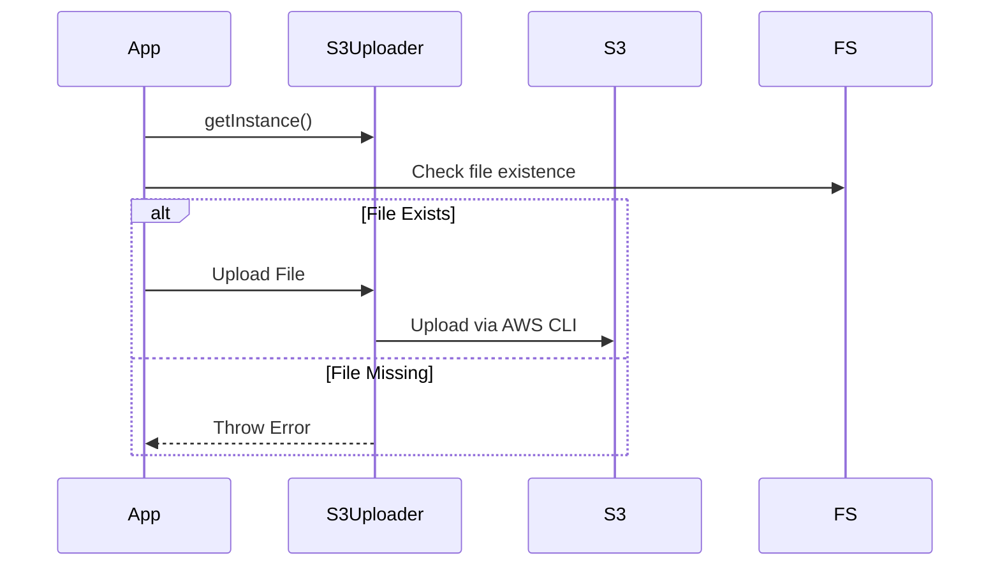
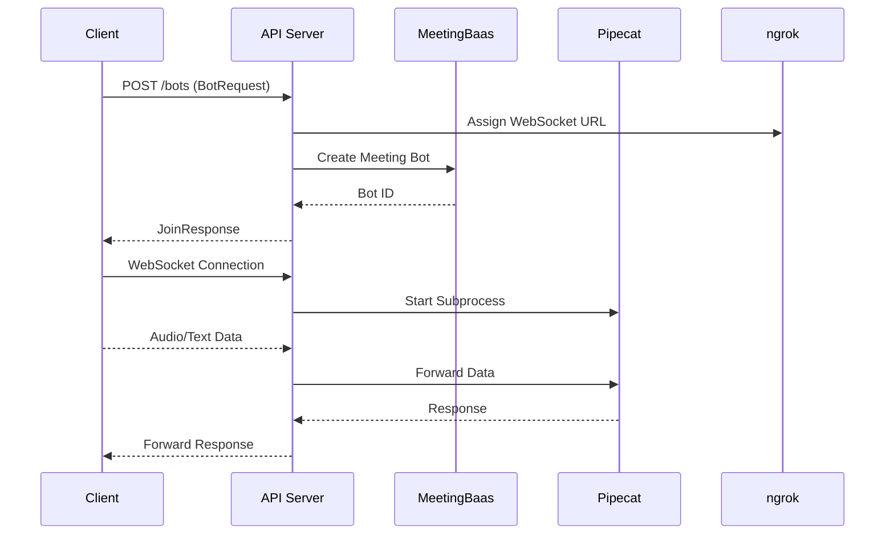
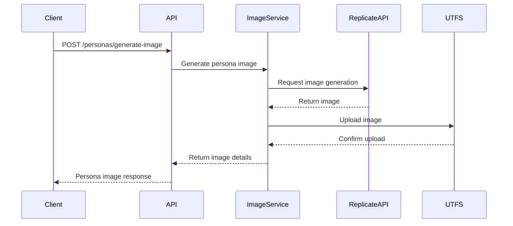
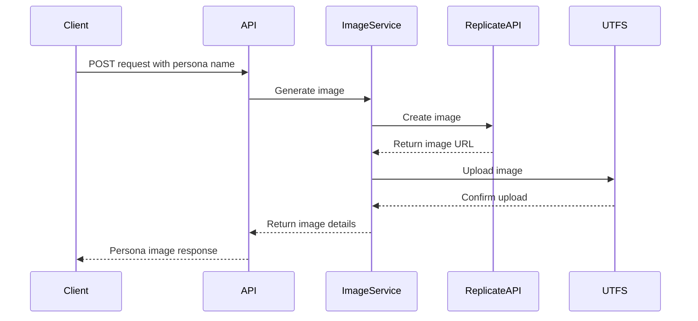
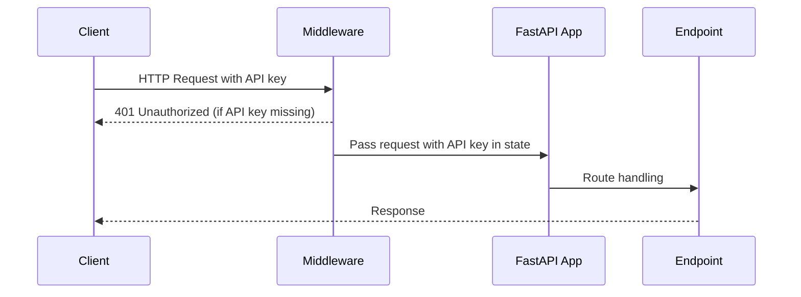

# updates Documentation

Documentation for updates.

## March 2, 2025

API - Automatically generated documentation based on Git activity.

### Source: ./content/docs/updates/api-2025-03-02.mdx


# API Updates 🐟

<Callout type="info">
  Dive into the latest updates - we're casting a wide net of improvements! 🎣
</Callout>

## March 2, 2025 Release

### Key Updates

<Steps>
  <Step>Calendar Integration Enhancements</Step>
  <Step>Security and Performance Improvements</Step>
  <Step>Code Quality Refinements</Step>
</Steps>

### Highlights

<Accordions>
  <Accordion title="Calendar Improvements" value="calendar-updates">
    Enhanced event filtering, improved attendee information management, and more robust credential handling.
  </Accordion>
  <Accordion title="Security Enhancements" value="security-updates">
    Addressed potential SQL injection vulnerabilities and improved overall system security.
  </Accordion>
</Accordions>

### Development Focus

<TypeTable 
  type={{
    calendarFiltering: {
      description: 'Improved security and maintainability of calendar event queries',
      type: 'enhancement',
      impact: 'High'
    },
    credentialManagement: {
      description: 'Preserved UUID during credential updates',
      type: 'bugfix',
      impact: 'Medium'
    }
  }}
/>

<Callout type="warn">
  Note: Internal updates that do not directly impact external API specifications.
</Callout>

---

## March 3, 2025

API - Automatically generated documentation based on Git activity.

### Source: ./content/docs/updates/api-2025-03-03.mdx


# API Updates 🐟

<Callout type="info">
  Diving into the latest updates like a bass swimming through code currents! 🎣
</Callout>

## March 3, 2025 Updates

### Key Changes

<Tabs items={['Fix Insufficient Tokens', 'Playwright Improvements']}>
  <Tab value="Fix Insufficient Tokens">
    <Steps>
      <Step>Addressed email cooldown check account filtering</Step>
      <Step>Improved token management mechanisms</Step>
    </Steps>
  </Tab>
  <Tab value="Playwright Improvements">
    <Steps>
      <Step>Enhanced streaming service integration</Step>
      <Step>Improved AWS instance management</Step>
      <Step>Updated transcription provider settings</Step>
    </Steps>
  </Tab>
</Tabs>

### Notable Modifications

<Accordions>
  <Accordion title="Token and Email Handling" value="token-management">
    Fixed issues related to insufficient token detection and email cooldown checks.
  </Accordion>
  <Accordion title="Streaming and Service Enhancements" value="streaming-improvements">
    Refined streaming service, improved error handling, and updated instance management processes.
  </Accordion>
</Accordions>

<Callout type="warn">
  Internal updates that do not directly impact external API specifications.
</Callout>

### Quick Highlights

- 🔧 Improved email cooldown filtering
- 🚀 Enhanced streaming service reliability
- ⏱️ Added timeout mechanisms for instance management
- 🔍 Refined error handling and detection processes

---

## March 4, 2025

API - Automatically generated documentation based on Git activity.

### Source: ./content/docs/updates/api-2025-03-04.mdx


# API Updates 🐟

<Callout type="info">
  Hooked on the latest API improvements? Let's dive into the updates! 🎣
</Callout>

## Overview

### Key Changes

<Tabs items={['Summary', 'Technical Details']}>
  <Tab value="Summary">
    - Minor documentation improvements
    - Internal wording refinements
  </Tab>
  <Tab value="Technical Details">
    <Files>
      <Folder name="api_server">
        <Folder name="baas_engine">
          <Folder name="src">
            <Folder name="tokens">
              <File name="constants.rs" />
            </Folder>
          </Folder>
        </Folder>
      </Folder>
    </Files>
  </Tab>
</Tabs>

## Commit Details

<Accordions>
  <Accordion title="Commit Overview" value="commit-info">
    Documentation wording improvement merged into master branch
  </Accordion>
</Accordions>

<Callout type="warn">
  Note: Specific code changes are not disclosed for confidentiality reasons.
</Callout>

## Additional Information

<Steps>
  <Step>Review completed</Step>
  <Step>Documentation refined</Step>
  <Step>Merge request processed</Step>
</Steps>

---

## March 5, 2025

API - Automatically generated documentation based on Git activity.

### Source: ./content/docs/updates/api-2025-03-05.mdx


# API Updates 🐟

<Callout type="info">
  Diving into our latest API improvements - making waves in the development sea! 🌊
</Callout>

## March 5, 2025 Updates

### Key Changes

The recent updates focus on internal improvements across several core API components:

<Accordions>
  <Accordion title="Calendar Module Updates" value="calendar">
    Refinements in calendar data retrieval and event handling processes.
  </Accordion>
  <Accordion title="Bot Service Enhancements" value="bots">
    Improvements in bot-related error handling and public interfaces.
  </Accordion>
</Accordions>

### Affected Components

<Files>
  <Folder name="api_server">
    <Folder name="baas_engine">
      <File name="calendar/data/get.rs" />
      <File name="bots/error.rs" />
      <File name="bots/data/post.rs" />
    </Folder>
    <Folder name="baas_handler">
      <File name="calendar/public/calendar_events.rs" />
      <File name="bots/public.rs" />
    </Folder>
  </Folder>
</Files>

### Implementation Notes

<Callout type="warn">
  These updates are internal improvements and do not directly impact external API contracts.
</Callout>

### Merge Request Details

Multiple merge requests were processed:
- MR !165: Documentation wording improvements
- MR !164: Additional documentation refinements
- MR !163: Default token adjustments

<TypeTable 
  type={{
    documentationScope: {
      description: 'Internal improvements and wording updates',
      type: 'string',
      default: 'N/A'
    },
    mergeCount: {
      description: 'Number of merge requests processed',
      type: 'number',
      default: '3'
    }
  }}
/>

---

## March 6, 2025

API - Automatically generated documentation based on Git activity.

### Source: ./content/docs/updates/api-2025-03-06.mdx


🐟 Hooked on API Updates? Let's dive into the latest catch! 

# Production Updates - March 6, 2025

<Callout type="info">
  Internal service improvements and refinements
</Callout>

## Key Changes

### Calendar and Filtering Improvements

The recent updates focus on two primary areas:

1. **Organizer Calendar Filtering**
   - Enhanced filtering mechanisms for calendar management
   - Improved data handling and retrieval processes

2. **Data Naming Conventions**
   - Transitioned to snake_case for calendar-related data structures
   - Standardized naming conventions across services

## Affected Components

<Files>
  <Folder name="meeting_bot">
    <Folder name="recording_server">
      <File name="browser.ts" />
      <Folder name="state-machine">
        <Folder name="states">
          <File name="error-state.ts" />
          <File name="initialization-state.ts" />
          <File name="recording-state.ts" />
        </Folder>
      </Folder>
    </Folder>
  </Folder>
  <Folder name="api_server">
    <Folder name="baas_engine">
      <File name="calendar/data/get.rs" />
    </Folder>
  </Folder>
</Files>

<Callout type="warn">
  These updates are internal and do not directly impact external API interfaces.
</Callout>

---

## March 11, 2025

API - Automatically generated documentation based on Git activity.

### Source: ./content/docs/updates/api-2025-03-11.mdx


# API Updates 🐟

<Callout type="info">
  Dive into the latest updates for our API service - we're making waves in backend improvements! 🌊
</Callout>

## Overview of Changes

This update focuses on improving browser setup and error handling across multiple components of our API and recording infrastructure.

### Key Improvements

<Steps>
  <Step>Enhanced browser setup reliability</Step>
  <Step>Improved error state management</Step>
  <Step>Refined calendar and webhook handling</Step>
</Steps>

### Affected Components

<Files>
  <Folder name="api_server">
    <Folder name="baas_engine">
      <File name="calendar/data/get.rs" />
      <File name="calendar/error.rs" />
      <File name="extend_axum/distributed_cache.rs" />
      <File name="webhook.rs" />
    </Folder>
    <Folder name="baas_handler">
      <File name="calendar/api.rs" />
      <File name="calendar/internal.rs" />
      <File name="calendar/public/calendars.rs" />
      <File name="tests/calendar.rs" />
    </Folder>
  </Folder>
  <Folder name="meeting_bot/recording_server">
    <Folder name="src">
      <Folder name="state-machine/states">
        <File name="error-state.ts" />
        <File name="initialization-state.ts" />
        <File name="recording-state.ts" />
      </Folder>
      <File name="browser.ts" />
      <File name="main.ts" />
      <File name="rabbitmq.ts" />
    </Folder>
  </Folder>
</Files>

### Potential Impact

<Callout type="warn">
  These changes may affect browser initialization and error handling in the recording infrastructure.
</Callout>

### Recommendations

- Review browser setup processes
- Test error state transitions
- Verify calendar and webhook integrations

<Tabs items={['Production', 'Development']}>
  <Tab value="Production">
    Recommended to update in a staged rollout
  </Tab>
  <Tab value="Development">
    Immediate testing recommended
  </Tab>
</Tabs>

---

## March 12, 2025

API - Automatically generated documentation based on Git activity.

### Source: ./content/docs/updates/api-2025-03-12.mdx


# API Updates - March 12, 2025 🐟

<Callout type="info">
  Hooked on our latest API improvements? Let's dive into the details! 🎣
</Callout>

## Key Updates

### Data Deletion Endpoint 

<Tabs items={['Feature', 'Protection']}>
  <Tab value="Feature">
    - New `/:uuid/delete_data` endpoint for deleting transcription data
    - Selective deletion preserves essential metadata
    - Detailed status reporting on deletion process
  </Tab>
  <Tab value="Protection">
    - Rate limiting: 5 requests per minute per API key
    - Enhanced rate limit headers:
      - `X-RateLimit-Limit`
      - `X-RateLimit-Remaining`
      - `X-RateLimit-Reset`
  </Tab>
</Tabs>

### Calendar Sync Improvements

<Steps>
  <Step>Added tracking for affected event UUIDs in calendar webhooks</Step>
  <Step>Improved borrowing and code verbosity in sync logic</Step>
  <Step>Preserved event metadata during synchronization</Step>
</Steps>

## Technical Highlights

<Callout type="warn">
  These updates enhance data management and API reliability while maintaining user privacy and system performance.
</Callout>

<TypeTable 
  type={{
    deleteDataEndpoint: {
      description: 'Secure data deletion mechanism',
      type: 'API Route',
      protection: 'Rate Limited'
    },
    calendarSync: {
      description: 'Enhanced event UUID tracking',
      type: 'Webhook Improvement',
      metadata: 'Preserved'
    }
  }}
/>

---

## March 14, 2025

API - Automatically generated documentation based on Git activity.

### Source: ./content/docs/updates/api-2025-03-14.mdx


# API Updates 🐟

<Callout type="info">
  Dive into the latest API improvements - we're making waves in the development sea! 🌊
</Callout>

## Recent Changes Overview

This update focuses on improvements to bot-related functionality and API routing:

<Steps>
  <Step>Enhanced Recent Bots Pagination</Step>
  <Step>Improved Bot Metadata Handling</Step>
  <Step>Refined Authentication Mechanisms</Step>
</Steps>

### Key Improvements

<Accordions>
  <Accordion title="Cursor-Based Pagination" value="pagination">
    Implemented more robust cursor-based pagination for recent bots endpoint, improving data retrieval efficiency.
  </Accordion>
  <Accordion title="Route Modifications" value="routing">
    Updated bot-related routes, including metadata and deletion endpoints.
  </Accordion>
  <Accordion title="Authentication Updates" value="auth">
    Removed legacy authentication methods to streamline security processes.
  </Accordion>
</Accordions>

### Technical Highlights

<Callout type="warn">
  Note: These changes impact internal API routing and data management.
</Callout>

- Improved list_recent_bots endpoint functionality
- Added support for custom JSON field filtering and sorting
- Enhanced OpenAPI specification documentation
- Implemented new delete_data route for bots

<Tabs items={['Pagination', 'Routing', 'Authentication']}>
  <Tab value="Pagination">
    Refined cursor-based pagination to provide more accurate and efficient data retrieval for recent bots.
  </Tab>
  <Tab value="Routing">
    Updated bot metadata routes and implemented new endpoint for data deletion.
  </Tab>
  <Tab value="Authentication">
    Removed legacy authentication methods to improve security and simplify access management.
  </Tab>
</Tabs>

<Callout type="info">
  For detailed implementation specifics, please consult the latest API documentation.
</Callout>

---

## March 18, 2025

API - Automatically generated documentation based on Git activity.

### Source: ./content/docs/updates/api-2025-03-18.mdx


🐟 Hooked on API Updates: Diving into the Latest Catch! 🐟

# API Service Updates

<Callout type="info">
  This update focuses on internal improvements to our transcription service.
</Callout>

## Key Changes

### Transcription Provider Enhancement

The recent update targets the audio extraction process for transcription, specifically modifying the Gladia provider implementation.

<Steps>
  <Step>Updated audio extraction logic in transcription provider</Step>
  <Step>Improved handling of audio processing</Step>
</Steps>

### Merge Request Details

<Accordions>
  <Accordion title="Merge Request Summary" value="mr-overview">
    Internal merge to improve audio transcription capabilities
  </Accordion>
</Accordions>

## Technical Highlights

<TypeTable 
  type={{
    provider: {
      description: 'Transcription service provider',
      type: 'string',
      default: 'Gladia'
    },
    audioExtraction: {
      description: 'Mechanism for extracting audio for transcription',
      type: 'method',
      default: 'Updated'
    }
  }}
/>

<Callout type="warn">
  Detailed code changes are not disclosed for confidentiality reasons.
</Callout>

---

## March 21, 2025

API - Automatically generated documentation based on Git activity.

### Source: ./content/docs/updates/api-2025-03-21.mdx


# API Updates 🐟

<Callout type="info">
  Diving into the latest API improvements - no fishing required! 
</Callout>

## Overview of Changes

This update focuses on internal improvements to the meeting recording and transcription systems. The changes primarily involve adjustments to the recording server and transcription-related components.

### Key Modifications

<Steps>
  <Step>Temporary removal of transcription from trampoline-end process</Step>
  <Step>Updates to meeting recording state management</Step>
  <Step>Refinements in chrome extension and recording server logic</Step>
</Steps>

### Affected Components

<Files>
  <Folder name="meeting_bot">
    <Folder name="recording_server">
      <File name="src/events.ts" />
      <File name="src/main.ts" />
      <File name="src/server.ts" />
      <Folder name="src/state-machine">
        <Folder name="states">
          <File name="error-state.ts" />
          <File name="in-call-state.ts" />
          <File name="recording-state.ts" />
        </Folder>
      </Folder>
    </Folder>
  </Folder>
</Files>

### Impact

<Callout type="warn">
  These changes are internal and do not directly affect external API consumers. The modifications are focused on improving the meeting recording and transcription infrastructure.
</Callout>

### Recommended Actions

- No immediate action required for API users
- Verify compatibility with existing integrations
- Monitor for any potential performance improvements

<Tabs items={['Production', 'Development']}>
  <Tab value="Production">
    Update to the latest version when available
  </Tab>
  <Tab value="Development">
    Review state machine and recording server changes
  </Tab>
</Tabs>

---

## March 27, 2025

API - Automatically generated documentation based on Git activity.

### Source: ./content/docs/updates/api-2025-03-27.mdx


# 🐟 API Updates - March 27, 2025

<Callout type="info">
  These updates reflect internal improvements to our API service, focusing on enhancing transcription, error handling, and system reliability.
</Callout>

## Key Changes

### Transcription and Audio Handling Improvements

<Steps>
  <Step>Enhanced audio file extension handling for recordings</Step>
  <Step>Improved transcription segment processing</Step>
  <Step>Centralized storage and error management for transcription tasks</Step>
</Steps>

### Build and Versioning Updates

<Tabs items={['Version', 'Timestamp']}>
  <Tab value="Version">
    - Added `build_timestamp` to version information
    - Provides more detailed build metadata
  </Tab>
  <Tab value="Timestamp">
    - New field populated from `VERGEN_BUILD_TIMESTAMP`
    - Enhances tracking of build versions
  </Tab>
</Tabs>

### Error Handling Enhancements

<Accordions>
  <Accordion title="Unified Error Conversion" value="error-conversion">
    Implemented `From<Box<dyn Error + Send + Sync>>` for MeetingBotError to improve error handling and readability.
  </Accordion>
  <Accordion title="Transcription Error Management" value="transcription-errors">
    Added more robust error logging and handling for transcription processes, including provider-specific error tracking.
  </Accordion>
</Accordions>

## Detailed Improvements

<Files>
  <Folder name="api_server" defaultOpen>
    <Folder name="baas_engine">
      <File name="transcriber/storage.rs">Improved S3 client and configuration handling</File>
      <File name="transcriber/transcribe.rs">Centralized transcription logic</File>
      <File name="bots/data/get.rs">Enhanced speaker tracking and transcript generation</File>
    </Folder>
    <Folder name="baas_handler">
      <File name="bots/internal.rs">Updated meeting end transcription flow</File>
      <File name="routers.rs">Added build timestamp to version endpoint</File>
    </Folder>
  </Folder>
</Files>

## Performance and Reliability

<TypeTable 
  type={{
    transcriptionSegments: {
      description: 'Improved audio segmentation processing',
      type: 'number',
      default: '100 segments per bot'
    },
    maxBotDuration: {
      description: 'Maximum meeting duration for transcription',
      type: 'number',
      default: '14400 seconds (4 hours)'
    }
  }}
/>

<Callout type="warn">
  These changes are internal improvements and do not directly impact external API contracts.
</Callout>

---

## March 28, 2025

API - Automatically generated documentation based on Git activity.

### Source: ./content/docs/updates/api-2025-03-28.mdx


🐟 Hooked on API Updates: Reeling in the Latest Catch! 🎣

# Production Updates - March 28, 2025

<Callout type="info">
  This update focuses on internal improvements to our bot transcription and processing systems.
</Callout>

## Key Changes

### Garbage Collector Improvements for Stalled Bots

<Steps>
  <Step>Refined bot processing logic for stalled transcriptions</Step>
  <Step>Enhanced error handling for transcription tasks</Step>
  <Step>Improved status tracking for bot processing</Step>
</Steps>

### Transcription Task Optimization

<Tabs items={['Before', 'After']}>
  <Tab value="Before">
    - Redundant transcription attempts
    - Limited error tracking
  </Tab>
  <Tab value="After">
    - Synchronized transcription process
    - Comprehensive error handling
    - Improved bot status updates
  </Tab>
</Tabs>

### Error Handling Enhancements

<Callout type="warn">
  Key improvements in tracking and managing transcription errors
</Callout>

- Removed duplicate transcription logic
- Added detailed error logging
- Implemented bot status updates for task failures

## Technical Highlights

<TypeTable 
  type={{
    transcriptionProcess: {
      description: 'Synchronous transcription handling',
      type: 'boolean',
      default: 'true'
    },
    errorTracking: {
      description: 'Enhanced error capture and reporting',
      type: 'boolean',
      default: 'true'
    }
  }}
/>

<Callout type="info">
  These changes improve system reliability and provide more transparent error tracking for bot processing.
</Callout>

---

## March 31, 2025

API - Automatically generated documentation based on Git activity.

### Source: ./content/docs/updates/api-2025-03-31.mdx


# API Updates - March 31, 2025 🐟

<Callout type="info">
  Hooked on improvements! Just like a bass swimming through code streams... 🎣
</Callout>

## Overview of Changes

### Merge Branches

We've merged two significant branches into the master:

1. **Ended At for Bots Already Started**
2. **Async Transcription End Meeting**

<Tabs items={['Bot Management', 'Transcription']}>
  <Tab value="Bot Management">
    <Steps>
      <Step>Added `ended_at` handling for bots that were already started</Step>
      <Step>Improved bot lifecycle management</Step>
      <Step>Enhanced error tracking and logging</Step>
    </Steps>
  </Tab>
  <Tab value="Transcription">
    <Steps>
      <Step>Moved transcription processing to background task</Step>
      <Step>Removed duplicate code for setting `ended_at`</Step>
      <Step>Optimized meeting end process</Step>
    </Steps>
  </Tab>
</Tabs>

## Key Modifications

### Files Updated

<Files>
  <Folder name="api_server" defaultOpen>
    <Folder name="baas_engine">
      <File name="Cargo.toml" />
      <File name="src/meeting_bot/starter.rs" />
    </Folder>
    <Folder name="baas_handler">
      <File name="Cargo.toml" />
      <File name="src/bots/internal.rs" />
      <File name="src/bots/public.rs" />
      <File name="src/calendar/api.rs" />
    </Folder>
  </Folder>
</Files>

### Technical Enhancements

<Callout type="warn">
  These changes improve system reliability and performance without modifying external API contracts.
</Callout>

- Implemented more robust bot lifecycle management
- Enhanced asynchronous transcription handling
- Improved error logging with bot identifier context

## Potential Impact

<TypeTable 
  type={{
    botLifecycle: {
      description: 'More precise tracking of bot start and end states',
      type: 'improved',
      default: 'previous implementation'
    },
    transcriptionProcessing: {
      description: 'Non-blocking background task for transcription',
      type: 'async',
      default: 'synchronous'
    }
  }}
/>

---

## April 3, 2025

API - Automatically generated documentation based on Git activity.

### Source: ./content/docs/updates/api-2025-04-03.mdx


# API Updates 🐟

<Callout type="info">
  Hooked on our latest updates? Let's dive into the API improvements! 🎣
</Callout>

## Key Changes

### Authentication and Security Enhancements

<Steps>
  <Step>Cross-Subdomain Authentication Enabled</Step>
  <Step>Authentication Code Cleanup</Step>
  <Step>Improved UUID Parameter Handling</Step>
</Steps>

### OpenAPI Specification Updates

<Callout type="warn">
  Several modifications have been made to the OpenAPI specification to improve type safety and documentation.
</Callout>

### Type-Safe Parameter Handling

<TypeTable 
  type={{
    UuidParam: {
      description: 'Structured type for UUID path parameters',
      type: 'Typed UUID',
      benefits: 'Improved type safety and OpenAPI documentation'
    }
  }}
/>

### Changes Overview

<Tabs items={['Authentication', 'Parameter Handling', 'Code Cleanup']}>
  <Tab value="Authentication">
    - Enabled cross-subdomain authentication
    - Cleaned up authentication code structure
  </Tab>
  <Tab value="Parameter Handling">
    - Introduced `UuidParam` for type-safe UUID handling
    - Updated route handlers to use structured parameter types
  </Tab>
  <Tab value="Code Cleanup">
    - Removed unnecessary functions
    - Streamlined internal API implementation
  </Tab>
</Tabs>

<Callout type="info">
  These updates enhance the API's reliability, security, and developer experience. 🚀
</Callout>

---

## April 8, 2025

API - Automatically generated documentation based on Git activity.

### Source: ./content/docs/updates/api-2025-04-08.mdx


🐟 Hooked on API Updates: Casting a Line into the Sea of Code! 🐟

# API Updates - April 8, 2025

<Callout type="info">
These updates reflect recent improvements to our API service and related infrastructure.
</Callout>

## Key Changes

### Chrome and Browser Improvements

<Tabs items={['Chrome Version', 'Platform Support']}>
  <Tab value="Chrome Version">
    - Updated Chrome version from `108.0.5359.94` to `126.0.6478.182`
    - Revised download URLs for multiple platforms
  </Tab>
  <Tab value="Platform Support">
    - Added macOS Chrome download link
    - Implemented platform-specific executable path detection
    - Updated extension ID flag to `--allowlisted-extension-id`
  </Tab>
</Tabs>

### Logging and Screenshot Enhancements

<Steps>
  <Step>Improved log upload mechanism to S3 bucket</Step>
  <Step>
    Enhanced screenshot utility with timestamp-based naming, disabled CSS animations, and improved image compression
  </Step>
  <Step>Added robust error handling for screenshot and log processes</Step>
</Steps>

### Dialog Management

<Accordions>
  <Accordion title="Dialog Observer Improvements" value="dialog-observer">
    Implemented more resilient dialog handling with:
    - Provider-specific mechanisms
    - Safety checks for page availability
    - Cleanup of existing observers
    - Multiple selector strategies
  </Accordion>
</Accordions>

## Changed Files

<Files>
  <Folder name="meeting_bot" defaultOpen>
    <Folder name="recording_server">
      <File name="package.json" />
      <File name="package-lock.json" />
      <File name="yarn.lock" />
      <Folder name="src">
        <File name="main.ts" />
        <File name="s3.ts" />
        <File name="browser.ts" />
      </Folder>
    </Folder>
    <File name="install_chrome.sh" />
  </Folder>
</Files>

<Callout type="warn">
  These updates improve system reliability, logging, and cross-platform compatibility.
</Callout>

---

## April 9, 2025

API - Automatically generated documentation based on Git activity.

### Source: ./content/docs/updates/api-2025-04-09.mdx


# 🐟 API Updates - Hooked on Improvements! 🐟

<Callout type="info">
  These updates reel in some exciting changes to our API service. Cast your line and dive into the details!
</Callout>

## Key Updates

### Zoom Integration Enhancements

<Tabs items={['Host Presence', 'Error Handling', 'Logging']}>
  <Tab value="Host Presence">
    - Implemented robust host presence verification before recording
    - Added polling mechanism to check for host in meeting
    - Graceful timeout handling for host-related scenarios
  </Tab>
  <Tab value="Error Handling">
    - Refined error message syntax
    - Improved grammatical correctness in error reporting
    - Enhanced error message clarity
  </Tab>
  <Tab value="Logging">
    - Added line number support in logs
    - Implemented more detailed logging configuration
    - Enhanced debug information visibility
  </Tab>
</Tabs>

### Dependency Updates

<TypeTable 
  type={{
    sharp: {
      description: 'Image processing library',
      type: 'string',
      version: '^0.34.1'
    },
    '@types/sharp': {
      description: 'TypeScript type definitions for Sharp',
      type: 'string', 
      version: '^0.31.1'
    }
  }}
/>

## Changed Files

<Files>
  <Folder name="meeting_bot">
    <Folder name="zoom">
      <File name="client/src/engine.rs" />
      <File name="client/src/remote_service.rs" />
    </Folder>
    <Folder name="recording_server">
      <File name="package.json" />
    </Folder>
  </Folder>
  <Folder name="api_server">
    <Folder name="baas_handler">
      <File name="src/main.rs" />
    </Folder>
  </Folder>
</Files>

## Commit Highlights

<Steps>
  <Step>Enhanced Zoom meeting bot state management</Step>
  <Step>Improved error message formatting</Step>
  <Step>Added dependency support for image processing</Step>
  <Step>Refined logging configuration</Step>
</Steps>

<Callout type="warn">
  These updates are internal and may impact service behavior. Test thoroughly before deployment.
</Callout>

---

## April 11, 2025

API - Automatically generated documentation based on Git activity.

### Source: ./content/docs/updates/api-2025-04-11.mdx


# API Updates 🐟

<Callout type="info">
  Dive into the latest API improvements! We're making waves in our service updates. 🌊
</Callout>

## Key Updates - April 11, 2025

### 🔍 Feature Highlights

<Tabs items={['Overview', 'Technical Details']}>
  <Tab value="Overview">
    - Enhanced MP4 file handling
    - Improved data retrieval logic
    - Webhook and transcription optimizations
  </Tab>
  <Tab value="Technical Details">
    The recent updates focus on more robust data processing and conditional URL generation for meeting-related resources.
  </Tab>
</Tabs>

### 🚧 Changes Overview

<Steps>
  <Step>Added file existence checks before URL generation</Step>
  <Step>Refined data fetching mechanisms</Step>
  <Step>Improved error handling and logging</Step>
</Steps>

### 🔬 Impacted Components

<Files>
  <Folder name="api_server" defaultOpen>
    <Folder name="baas_engine">
      <File name="auth/data/get.rs" />
      <File name="meeting_bot/starter.rs" />
      <File name="schema.rs" />
    </Folder>
    <Folder name="migrations">
      <Folder name="2025-04-08-140628_add_secret_into_account">
        <File name="up.sql" />
        <File name="down.sql" />
      </Folder>
    </Folder>
  </Folder>
</Files>

### 🎣 Key Improvements

<Callout type="warn">
  These updates ensure more reliable data handling and prevent unnecessary link generation when no data is available.
</Callout>

### 🔒 Confidentiality Note

<Callout type="info">
  Specific implementation details are kept confidential to maintain service integrity.
</Callout>

---

## April 17, 2025

API - Automatically generated documentation based on Git activity.

### Source: ./content/docs/updates/api-2025-04-17.mdx


🐟 Hopping through code like a bass in a meeting stream! Let's dive into these API updates. 🐟

# API Updates - April 17, 2025

<Callout type="info">
  This update focuses on enhancing the API service with improvements to routing, authentication, and bot interactions.
</Callout>

## Key Changes

### Route Path Parameter Updates
- Transitioned route path parameters from `{uuid}` to `:uuid` syntax
- Updated OpenAPI input declarations
- Refined documentation strings for endpoints

### Secret Management Enhancements
- Added `secret` field to `Account` and `WorkerBotMessage` structures
- Implemented database migration to include non-nullable `secret` column
- Integrated secret handling in S3 upload and bot configuration processes

### Meeting Bot Reliability Improvements
- Reduced maximum layout change retries
- Enhanced `isInMeeting` checks before and after critical UI actions
- Simplified bot presence detection logic

## Affected Components

<Files>
  <Folder name="api_server" defaultOpen>
    <Folder name="baas_engine">
      <File name="src/auth/data/get.rs" />
      <File name="src/meeting_bot/starter.rs" />
      <File name="src/schema.rs" />
      <File name="src/worker/worker_bot.rs" />
    </Folder>
    <Folder name="baas_handler">
      <File name="src/main.rs" />
      <File name="src/routers.rs" />
    </Folder>
    <Folder name="migrations">
      <Folder name="2025-04-08-140628_add_secret_into_account">
        <File name="up.sql" />
        <File name="down.sql" />
      </Folder>
    </Folder>
  </Folder>
  <Folder name="meeting_bot" defaultOpen>
    <Folder name="recording_server">
      <File name="src/meeting/meet.ts" />
      <File name="src/utils/PathManager.ts" />
      <File name="src/utils/S3Uploader.ts" />
    </Folder>
  </Folder>
</Files>

## Highlights

<Tabs items={['Routing', 'Authentication', 'Bot Interactions']}>
  <Tab value="Routing">
    - Standardized route parameter syntax
    - Improved API documentation clarity
  </Tab>
  <Tab value="Authentication">
    - Introduced secret-based authentication
    - Enhanced account security mechanisms
  </Tab>
  <Tab value="Bot Interactions">
    - Reduced bot interaction failure points
    - Improved meeting presence detection
  </Tab>
</Tabs>

<Callout type="warn">
  These changes may require updates to existing integrations. Please review implementation details carefully.
</Callout>

---

## April 18, 2025

API - Automatically generated documentation based on Git activity.

### Source: ./content/docs/updates/api-2025-04-18.mdx


# 🐟 API Updates: Streamlining Credentials and Message Processing

<Callout type="info">
  Dive into the latest updates that keep our API swimming smoothly! 🏊‍♀️
</Callout>

## Key Updates

### Credential and Path Handling Improvements

<Steps>
  <Step>Enhanced AWS path generation with client secret integration</Step>
  <Step>Improved S3 recording path retrieval mechanisms</Step>
  <Step>Removed unnecessary fallback code</Step>
</Steps>

### RabbitMQ Message Processing Optimization

<Tabs items={['Before', 'After']}>
  <Tab value="Before">Potential race conditions in message handling</Tab>
  <Tab value="After">Serialized message processing with `isProcessing` flag</Tab>
</Tabs>

### Zoom Credential Management

<Callout type="warn">
  Custom Zoom credentials now implemented to improve authentication flexibility
</Callout>

## Changed Components

<Files>
  <Folder name="api_server" defaultOpen>
    <Folder name="baas_engine">
      <File name="src/bots/data/post.rs" />
      <File name="src/lib.rs" />
      <File name="src/s3/get_recording_path.rs" />
    </Folder>
    <Folder name="baas_handler">
      <File name="src/bots/public.rs" />
    </Folder>
  </Folder>
  <Folder name="meeting_bot">
    <Folder name="recording_server">
      <File name="src/rabbitmq.ts" />
    </Folder>
  </Folder>
</Files>

## Performance Highlights

- 🚀 Improved error handling in S3 operations
- 🔒 Enhanced credential management
- 🐰 Optimized RabbitMQ message processing

<Callout type="info">
  These updates ensure more robust and efficient API operations behind the scenes.
</Callout>

---

## April 22, 2025

API - Automatically generated documentation based on Git activity.

### Source: ./content/docs/updates/api-2025-04-22.mdx


# API Updates - April 22, 2025 🐟

<Callout type="info">
  Dive into the latest API improvements! We're scaling up our code like a bass swimming upstream. 🐟
</Callout>

## Overview of Changes

This update includes two primary merge requests focusing on documentation refinements and log upload processes.

### Documentation Refinement

<Steps>
  <Step>Updated schema documentation in `post.rs`</Step>
  <Step>Corrected typos and terminology</Step>
  <Step>Improved field descriptions</Step>
</Steps>

### Log Upload Enhancement

<Steps>
  <Step>Modified `PathManager` instantiation</Step>
  <Step>Added `secret` parameter to log upload process</Step>
  <Step>Improved path resolution for log files</Step>
</Steps>

## Key Files Updated

<Files>
  <Folder name="api_server">
    <Folder name="baas_engine">
      <File name="datetime.rs" />
      <File name="bots/data/post.rs" />
    </Folder>
    <Folder name="baas_handler">
      <File name="src/bots/public.rs" />
      <File name="src/routers.rs" />
    </Folder>
  </Folder>
</Files>

<Callout type="warn">
  These changes are internal and do not directly impact external API consumers.
</Callout>

---

## April 23, 2025

API - Automatically generated documentation based on Git activity.

### Source: ./content/docs/updates/api-2025-04-23.mdx


# 🐟 API Updates - April 23, 2025

<Callout type="info">
Dive into the latest updates for our Meeting Bass API! 🎣 Just like a skilled angler, we've been refining our code to catch the best performance.
</Callout>

## Key Changes

### S3 Uploader Singleton Refactoring

<Steps>
<Step>Implemented singleton pattern for `S3Uploader`</Step>
<Step>Enhanced error handling and file existence checks</Step>
<Step>Consolidated S3 utility functions</Step>
</Steps>

### Logging Improvements

<Tabs items={['Before', 'After']}>
<Tab value="Before">
- Separate S3 utility files
- Limited error handling
</Tab>
<Tab value="After">
- Centralized S3 upload management
- Robust error logging
- Automatic crash log uploads
</Tab>
</Tabs>

### File Changes

<Files>
<Folder name="meeting_bot/recording_server/src" defaultOpen>
    <Folder name="utils">
        <File name="S3Uploader.ts" />
        <File name="pinoLogger.ts" />
        <File name="takeScreenshot.ts" />
    </Folder>
    <Folder name="recording">
        <File name="AudioExtractor.ts" />
        <File name="Transcoder.ts" />
    </Folder>
    <File name="main.ts" />
</Folder>
</Files>

### Sequence of Changes



### Improvements Highlights

<TypeTable 
    type={{
        singletonPattern: {
            description: 'Ensures single S3Uploader instance',
            type: 'Design Pattern',
            default: 'Multiple instances'
        },
        errorHandling: {
            description: 'Enhanced error detection and logging',
            type: 'Robustness',
            default: 'Basic error handling'
        }
    }}
/>

---

## Updates

Latest updates, improvements, and changes to Meeting BaaS services

### Source: ./content/docs/updates/index.mdx


# Meeting BaaS Updates

This section contains the latest updates, improvements, and changes to Meeting BaaS services.
Stay up-to-date with new features, bug fixes, and important announcements.

## Update Categories

<ServicesListSSR />

## How Updates Are Organized

1. **Date**: When the update was released
2. **Content Type**: Features, bug fixes, improvements
3. **Service**: Which Meeting BaaS service was updated
4. **Commit Details**: Information about the specific changes made

Click on any update in the sidebar to view detailed information about that update.


---

## March 8, 2025

MCP Servers - Automatically generated documentation based on Git activity.

### Source: ./content/docs/updates/mcp-servers-2025-03-08.mdx


# MCP Servers Updates 🐟

<Callout type="info">
  Looks like we're diving deep into the MCP Servers today - hope you're ready to navigate these technical waters! 🌊
</Callout>

## Overview of Changes

The recent updates to the MCP Servers involve several key modifications across different components of the service.

### Key Files Updated
<Files>
  <File name="README.md" />
  <File name="api/server.ts" />
  <File name="public/index.html" />
  <File name="vercel.json" />
</Files>

### Commit Highlights

<Tabs items={['Initial Setup', 'Working Changes', 'Creation Fix', 'Log Updates']}>
  <Tab value="Initial Setup">
    - Initial project configuration established
    - Basic infrastructure set up
  </Tab>
  <Tab value="Working Changes">
    - Ongoing development and refinement
    - Potential improvements to existing functionality
  </Tab>
  <Tab value="Creation Fix">
    - Addressed potential creation-related issues
    - Ensuring robust initialization processes
  </Tab>
  <Tab value="Log Updates">
    - Logging mechanisms potentially enhanced
    - Improved tracking and monitoring capabilities
  </Tab>
</Tabs>

## Important Notes

<Callout type="warn">
  Detailed code diffs are not available. For comprehensive change information, use git command-line tools or a git UI.
</Callout>

## Next Steps

1. Review the updated files
2. Verify compatibility with existing systems
3. Test new configurations thoroughly

<Callout type="info">
  Remember: In the sea of code, always keep your development compass pointing true! 🧭🐟
</Callout>

---

## March 9, 2025

MCP Servers - Automatically generated documentation based on Git activity.

### Source: ./content/docs/updates/mcp-servers-2025-03-09.mdx


# MCP Servers Updates 🐟

<Callout type="info">
  Diving deep into the code ocean today! Catch of the day: MCP Servers updates that'll make your development swim smoothly. 🎣
</Callout>

## Key Updates Overview

### Configuration and Environment Improvements

<Steps>
  <Step>
    **Redis Configuration**
    - `REDIS_URL` is now a required environment variable
    - Ensures proper connection and configuration
  </Step>
  
  <Step>
    **Timeout Handling**
    - Dynamic timeout mechanisms implemented
    - Improved server responsiveness and reliability
  </Step>
  
  <Step>
    **Capability Support**
    - Enhanced capability management
    - More flexible service configurations
  </Step>
</Steps>

### Infrastructure Updates

<Tabs items={['Vercel Config', 'README', 'Project Structure']}>
  <Tab value="Vercel Config">
    - Updated `vercel.json` for deployment optimizations
    - Potential performance and scaling improvements
  </Tab>
  
  <Tab value="README">
    - Documentation updates
    - Improved project information and guidelines
  </Tab>
  
  <Tab value="Project Structure">
    - Minor refactoring in project files
    - Cleanup of existing code
  </Tab>
</Tabs>

## Changed Files

<Files>
  <Folder name="project" defaultOpen>
    <File name="README.md" />
    <File name="vercel.json" />
    <Folder name="lib">
      <File name="mcp-api-handler.ts" />
    </Folder>
    <Folder name="api">
      <File name="server.ts" />
    </Folder>
  </Folder>
</Files>

<Callout type="warn">
  Detailed code changes are not disclosed for confidentiality reasons.
</Callout>

---

## March 10, 2025

MCP Servers - Automatically generated documentation based on Git activity.

### Source: ./content/docs/updates/mcp-servers-2025-03-10.mdx


🐟 Looks like we're diving into some MCP Servers updates! Let's see what's swimming in our code ocean today.

# MCP Servers Updates

<Callout type="info">
  Quick snapshot of recent changes in the MCP Servers ecosystem
</Callout>

## Overview

### File Updated
- `lib/mcp-api-handler.ts`

<Tabs items={['Changes', 'Impact']}>
  <Tab value="Changes">
    <Callout type="warn">
      Minimal details available about specific code modifications
    </Callout>
  </Tab>
  <Tab value="Impact">
    No immediate user-facing changes detected
  </Tab>
</Tabs>

## Additional Context

<Accordions>
  <Accordion title="Commit Details" value="commit-info">
    - **Date:** March 10, 2025
    - **Commit Hash:** `d44c0c5baa0931414b166546bc45ac97d15ce460`
  </Accordion>
</Accordions>

<Callout type="info">
  For precise code changes, use git command-line tools or a Git UI for detailed diff review.
</Callout>

---

## March 11, 2025

MCP Servers - Automatically generated documentation based on Git activity.

### Source: ./content/docs/updates/mcp-servers-2025-03-11.mdx


🐟 Navigating the MCP Servers update? Let's dive into the details! 

<Callout type="info">
  Quick Update: Minor changes to MCP Servers routing configuration
</Callout>

# MCP Servers Update

## Overview

A small but significant update was made to the MCP Servers routing configuration on March 11, 2025.

<Steps>
  <Step>Routing configuration modified</Step>
  <Step>README.md file updated</Step>
</Steps>

## Key Changes

### Routing Modification

The update involves removing routing to the root path (`/`). While specific implementation details are limited, this suggests a potential refinement of the service's routing strategy.

<Callout type="warn">
  Impact: Minimal expected user-facing changes
</Callout>

## File Changes

<Files>
  <File name="README.md" />
</Files>

## Additional Notes

<Accordions>
  <Accordion title="Detailed Diff Information">
    For comprehensive code differences, we recommend using Git command-line tools or a Git UI for precise change tracking.
  </Accordion>
</Accordions>

---

## April 7, 2025

MCP Servers - Automatically generated documentation based on Git activity.

### Source: ./content/docs/updates/mcp-servers-2025-04-07.mdx


🐟 Hooked on updates? Let's dive into the latest MCP Servers catch of the day! 

<Callout type="info">
  Quick Snapshot: Minor updates and administrative housekeeping for the MCP Servers project.
</Callout>

# MCP Servers Updates

## Key Changes

### Project Maintenance

The team has made some administrative updates to the project:

<Steps>
  <Step>Added project LICENSE file</Step>
  <Step>Updated README.md documentation</Step>
</Steps>

### Modified Files

<Files>
  <File name="lib/mcp-api-handler.ts" />
  <File name="package.json" />
  <Folder name="scripts">
    <File name="test-streamable-http-client.mjs" />
  </Folder>
  <File name="LICENSE" />
  <File name="pnpm-lock.yaml" />
</Files>

## Additional Notes

<Callout type="warn">
  Detailed code changes are not publicly available. For specific diff information, use git command-line tools or a git UI.
</Callout>

<Accordions>
  <Accordion title="Want to know more?" value="details">
    Curious about the nitty-gritty? While we can't reveal all the details, these updates suggest ongoing project maintenance and potential minor improvements.
  </Accordion>
</Accordions>

---

## April 22, 2025

MCP Servers - Automatically generated documentation based on Git activity.

### Source: ./content/docs/updates/mcp-servers-2025-04-22.mdx


🐟 Hooked on Updates: MCP Servers Edition! Let's dive into the latest changes that'll make your code swim smoothly. 

<Callout type="info">
  This update focuses on stateless MCP server improvements, bringing more flexibility to your infrastructure.
</Callout>

# MCP Servers Updates

## Key Changes

<Steps>
  <Step>Refactored server configuration</Step>
  <Step>Updated TypeScript configuration</Step>
  <Step>Package dependencies adjusted</Step>
</Steps>

## Modified Files

<Files>
  <File name="api/server.ts" />
  <File name="package.json" />
  <File name="tsconfig.json" />
</Files>

## Technical Insights

The recent commit introduces a stateless approach to MCP servers, which means:
- Improved scalability
- More predictable server behavior
- Enhanced deployment flexibility

<Callout type="warn">
  Developers should review their current server configurations to ensure compatibility with the new stateless model.
</Callout>

## Recommended Actions

- Review `api/server.ts` for configuration changes
- Check `package.json` for dependency updates
- Verify TypeScript configuration in `tsconfig.json`

<Tabs items={['Quick Check', 'Detailed Review']}>
  <Tab value="Quick Check">
    ```bash
    npm install
    npm run type-check
    ```
  </Tab>
  <Tab value="Detailed Review">
    ```bash
    # Perform comprehensive system tests
    npm run test:integration
    npm run lint
    ```
  </Tab>
</Tabs>

---

## April 23, 2025

MCP Servers - Automatically generated documentation based on Git activity.

### Source: ./content/docs/updates/mcp-servers-2025-04-23.mdx


# MCP Servers Updates 🐟

<Callout type="info">
  Looks like we're scaling up our Meeting Bass (BaaS) SDK with some fin-tastic improvements! 🐟
</Callout>

## Key Updates

### SDK and Tool Enhancements

The recent updates focus on improving the Meeting BaaS SDK integration and tool registration:

<Steps>
  <Step>Integrated Meeting-BaaS SDK</Step>
  <Step>Implemented auto-tool registration</Step>
  <Step>Added type-safe tool execution</Step>
</Steps>

### API Key and Authentication

Significant improvements in API key handling:

- Implemented schema-based API key validation
- Refined API key checking mechanism
- Improved type definitions for authentication

### Performance and Reliability

<Tabs items={['Redis Integration', 'Timeout Handling']}>
  <Tab value="Redis Integration">
    Added Redis integration with Upstash for improved caching and performance
  </Tab>
  <Tab value="Timeout Handling">
    Enhanced timeout management for more robust tool execution
  </Tab>
</Tabs>

### Development Workflow

<Callout type="warn">
  Note: Several refactoring efforts were made to improve code organization and maintainability
</Callout>

- Moved tools to separate files
- Added TypeScript setup
- Simplified tool registration process

## File Changes

<Files>
  <Folder name="api" defaultOpen>
    <Folder name="tools">
      <File name="index.ts" />
      <File name="server.ts" />
      <Folder name="bots">
        <File name="join.ts" />
        <File name="join-speaking.ts" />
      </Folder>
    </Folder>
  </Folder>
  <File name="package.json" />
  <File name="global.d.ts" />
</Files>

---

## April 7, 2025

TypeScript SDK - Automatically generated documentation based on Git activity.

### Source: ./content/docs/updates/sdk-2025-04-07.mdx


# TypeScript SDK Updates 🐟

<Callout type="info">
  Hooked on our latest SDK updates? Let's dive into the changes! 🎣
</Callout>

## Key Updates

### Generated API and Model Enhancements

This update introduces significant improvements to our SDK:

<Tabs items={['Generated APIs', 'New Models']}>
  <Tab value="Generated APIs">
    - Default API
    - Calendar API
    - Webhook API
  </Tab>
  <Tab value="New Models">
    - SpeechToTextProvider
    - AudioFrequency
    - RecordingMode
    - JoinRequest
  </Tab>
</Tabs>

### Changes Overview

<Steps>
  <Step>Updated `.gitignore` to track `dist/` and `src/generated/` directories</Step>
  <Step>Renamed `SpeechToText` type references to `SpeechToTextProvider`</Step>
  <Step>Improved code readability with method signature reformatting</Step>
</Steps>

### Type and Method Updates

<Accordions>
  <Accordion title="Type Refinements" value="types">
    - Consistent use of `SpeechToTextProvider` across type references
    - Updated parameter types in multiple methods
  </Accordion>
  <Accordion title="Method Signature Improvements" value="methods">
    - Reformatted `deleteData` method for better readability
    - No changes to method logic or return types
  </Accordion>
</Accordions>

<Callout type="warn">
  These changes improve type consistency and code readability without altering core functionality.
</Callout>

---

## April 17, 2025

TypeScript SDK - Automatically generated documentation based on Git activity.

### Source: ./content/docs/updates/sdk-2025-04-17.mdx


# TypeScript SDK Updates 🐟

<Callout type="info">
  Dive into the latest updates for our TypeScript SDK - where code meets clarity, and updates swim smoothly! 
</Callout>

## Version 4.0.3 Highlights

### 🚀 Key Improvements

- Enhanced TypeScript ESM support
- Refined package export mappings
- Improved module compatibility

### 📦 Version Bump Details

<Tabs items={['Package', 'OpenAPI Generator']}>
  <Tab value="Package">
    - Updated to version 4.0.3
    - Added explicit type, ESM, and CommonJS entry points
  </Tab>
  <Tab value="OpenAPI Generator">
    - Version updated to 4.0.3
    - Improved configuration consistency
  </Tab>
</Tabs>

### 🛠 Build Process Enhancements

<Steps>
  <Step>Added TypeScript compiler option for declaration files</Step>
  <Step>Generated `.d.mts` files for ESM type declarations</Step>
  <Step>Improved module compatibility</Step>
</Steps>

### 🔍 Technical Details

<Accordions>
  <Accordion title="Export Mapping" value="exports">
    ```json
    "exports": {
      "./dist/baas/*": {
        "types": "./dist/baas/*.d.ts",
        "import": "./dist/baas/*.mjs",
        "require": "./dist/baas/*.js"
      }
    }
    ```
  </Accordion>
</Accordions>

### 📝 Changelog

- Bumped package version to 4.0.3
- Refined package export mappings
- Added TypeScript ESM support for declaration files

## Upgrade Recommendations

<Callout type="warn">
  When upgrading, ensure you're using the main package entry point for imports.
</Callout>

```typescript
// Recommended
import { YourType } from '@meeting-baas/sdk';

// Avoid direct imports from generated files

---

## March 2, 2025

Speaking Bots - Automatically generated documentation based on Git activity.

### Source: ./content/docs/updates/speaking-bots-2025-03-02.mdx


🐟 Hooked on APIs: Where Every Request is a Catch of the Day! 🐟

<Callout type="info">
  This update introduces significant improvements to the Speaking Bots service, focusing on API-first architecture and enhanced bot management.
</Callout>

# Speaking Bots Service Updates

## Key Enhancements

<Tabs items={['API', 'Bot Management', 'Configuration']}>
  <Tab value="API">
    - Introduced FastAPI-based server for bot orchestration
    - Added `/run-bots` endpoint for dynamic bot creation
    - Implemented WebSocket support for real-time communication
  </Tab>
  <Tab value="Bot Management">
    - Enhanced bot configuration flexibility
    - Added support for multiple bot instances
    - Improved persona and meeting URL handling
  </Tab>
  <Tab value="Configuration">
    - New CLI arguments for granular control
    - Environment variable fallback mechanisms
    - Secure API key management
  </Tab>
</Tabs>

## API Endpoints

<Steps>
  <Step>POST `/run-bots`: Create and manage bot instances</Step>
  <Step>WebSocket `/ws/{client_id}`: Real-time communication</Step>
  <Step>GET `/`: Health check endpoint</Step>
</Steps>

## Example Bot Request

```json
{
  "count": 2,
  "meeting_url": "https://meeting.example.com",
  "personas": ["technical_expert", "facilitator"],
  "recorder_only": false,
  "websocket_url": "ws://localhost:8000"
}
```

## Notable Improvements

<Accordions>
  <Accordion title="API Architecture" value="api-arch">
    - Lightweight FastAPI server
    - Asynchronous bot management
    - Flexible configuration options
  </Accordion>
  
  <Accordion title="WebSocket Integration" value="websocket">
    - Multi-client support
    - Real-time bot communication
    - Robust connection handling
  </Accordion>
</Accordions>

## Deployment Considerations

<Callout type="warn">
  Ensure proper API key management and secure WebSocket configurations.
</Callout>

---

## April 15, 2025

Speaking Bots - Automatically generated documentation based on Git activity.

### Source: ./content/docs/updates/speaking-bots-2025-04-15.mdx


🐟 Hooked on APIs: Where Every Endpoint is a Catch! 🎣

# Speaking Bots Service Updates - April 15, 2025

<Callout type="info">
  This update introduces a comprehensive API-first architecture for managing speaking meeting bots, replacing previous CLI and subprocess-based approaches.
</Callout>

## Key Highlights

### 🚀 New Architecture
- Introduced FastAPI server with robust HTTP and WebSocket endpoints
- Implemented modular, asynchronous bot lifecycle management
- Added ngrok integration for local development

### 🛠 Core Improvements
- Enhanced persona management
- Improved error handling and logging
- Streamlined deployment configurations

## Major Changes

<Tabs items={['API', 'WebSockets', 'Deployment']}>
  <Tab value="API">
    - Created typed Pydantic models for bot requests and responses
    - Implemented comprehensive API endpoints for bot creation and management
    - Added OpenAPI schema documentation
  </Tab>
  <Tab value="WebSockets">
    - Developed real-time audio streaming via WebSocket
    - Implemented connection management utilities
    - Added robust error handling for WebSocket communications
  </Tab>
  <Tab value="Deployment">
    - Updated Dockerfile for modern Python runtime
    - Added Fly.io deployment configuration
    - Improved environment variable management
  </Tab>
</Tabs>

## Code Structure Transformation

<Files>
  <Folder name="app" defaultOpen>
    <File name="main.py" />
    <File name="routes.py" />
    <File name="websockets.py" />
  </Folder>
  <Folder name="core">
    <File name="process.py" />
    <File name="connection.py" />
    <File name="router.py" />
  </Folder>
  <Folder name="utils">
    <File name="ngrok.py" />
    <File name="process.py" />
  </Folder>
</Files>

## Sequence of Bot Lifecycle



## Breaking Changes

<Callout type="warn">
  - Removed legacy CLI and subprocess-based bot management
  - Replaced old bot creation methods with new API-driven approach
  - Requires updated client implementations to use new API endpoints
</Callout>

## Migration Guide

<Steps>
  <Step>Update client libraries to use new FastAPI endpoints</Step>
  <Step>Replace subprocess management with API calls</Step>
  <Step>Implement WebSocket communication according to new protocol</Step>
  <Step>Update environment configurations</Step>
</Steps>

## Future Roadmap

- Enhanced AI persona management
- More granular bot control interfaces
- Improved real-time communication protocols

<Callout type="info">
  Swim upstream with our new API architecture! 🐟
</Callout>

---

## April 23, 2025

Speaking Bots - Automatically generated documentation based on Git activity.

### Source: ./content/docs/updates/speaking-bots-2025-04-23.mdx


# 🐟 Speaking Bots: Persona Image Generation Update

<Callout type="info">
Dive into our latest feature that brings personas to life with AI-generated images! 🎨
</Callout>

## New Feature: Persona Image Generation API

### Key Improvements

<Steps>
<Step>Added new endpoint for generating persona images</Step>
<Step>Implemented robust image generation service</Step>
<Step>Enhanced error handling and response structures</Step>
</Steps>

### Technical Details

<Tabs items={['Models', 'Routes', 'Image Service']}>
<Tab value="Models">
- Added `PersonaImageRequest` model
- Created `PersonaImageResponse` model
- Supports detailed persona description inputs
</Tab>

<Tab value="Routes">
- New POST endpoint: `/personas/generate-image`
- Accepts persona details like name, gender, description
- Returns generated image URL and metadata
</Tab>

<Tab value="Image Service">
- Integrates with Replicate AI for image generation
- Uploads generated images to UTFS
- Handles various image generation scenarios
</Tab>
</Tabs>

### Example Request

```python
# Generate a persona image
request = PersonaImageRequest(
    name="Alex Johnson",
    gender="neutral",
    description="A creative software engineer",
    characteristics=["glasses", "professional attire"]
)
```

### Sequence of Image Generation



<Callout type="warn">
⚠️ Beta Feature: Image generation may have occasional variations in output quality.
</Callout>

---

## April 24, 2025

Speaking Bots - Automatically generated documentation based on Git activity.

### Source: ./content/docs/updates/speaking-bots-2025-04-24.mdx


# Speaking Bots Image Generation Update 🐟

<Callout type="info">
  Dive into the latest waves of our persona image generation feature! We're making image creation as smooth as a bass gliding through water. 🐟
</Callout>

## Key Updates

### Image Generation Improvements

<Steps>
  <Step>Enhanced persona image generation with more precise name-based prompts</Step>
  <Step>Improved image creation workflow</Step>
  <Step>Refined error handling and image upload process</Step>
</Steps>

### Major Changes

<Tabs items={['Models', 'Routes', 'Services']}>
  <Tab value="Models">
    - Removed `prompt` field from `PersonaImageResponse`
    - Added `name` field to response model
  </Tab>
  <Tab value="Routes">
    - Updated `generate_persona_image` endpoint
    - Improved prompt construction
    - Refined image generation parameters
  </Tab>
  <Tab value="Services">
    - Added new `generate_persona_image` method
    - Implemented robust image generation logic
    - Enhanced error handling
  </Tab>
</Tabs>

### Technical Highlights

<Callout type="warn">
  Image generation now focuses on creating persona-specific images using the persona's name as a key input.
</Callout>

#### Image Generation Workflow



### Improvements Breakdown

<TypeTable 
  type={{
    "Image Generation": {
      description: "More precise persona-specific image creation",
      type: "Enhanced Algorithm",
      impact: "High"
    },
    "Prompt Construction": {
      description: "Uses persona name for more accurate results",
      type: "String Transformation",
      impact: "Medium"
    },
    "Error Handling": {
      description: "Improved robustness in image generation process",
      type: "Error Management",
      impact: "High"
    }
  }}
/>

<Callout type="info">
  Swim smoothly through our updated image generation feature - making persona images as unique as each fish in the sea! 🐟
</Callout>

---

## April 29, 2025

Speaking Bots - Automatically generated documentation based on Git activity.

### Source: ./content/docs/updates/speaking-bots-2025-04-29.mdx


# Speaking Bots Service Update 🐟

<Callout type="info">
  Hooked on API security? We've just reeled in a robust authentication mechanism! 🎣
</Callout>

## Authentication Enhancements

### Key Changes

- **API Key Authentication**: Implemented middleware-based authentication
- **Security Improvements**: 
  - Added API key header requirement
  - Excluded documentation endpoints from authentication
  - Centralized API key handling

### Technical Details

<Tabs items={['Authentication', 'OpenAPI Schema', 'Endpoint Updates']}>
  <Tab value="Authentication">
    - Middleware checks for `x-meeting-baas-api-key` header
    - Stores API key in request state for downstream use
    - Provides consistent authentication across endpoints
  </Tab>
  <Tab value="OpenAPI Schema">
    - Extended OpenAPI documentation
    - Added security scheme
    - Updated schema for persona image generation
  </Tab>
  <Tab value="Endpoint Updates">
    - Removed API key fields from request models
    - Updated endpoint logic to use middleware-based authentication
    - Improved API key retrieval process
  </Tab>
</Tabs>

### Key Files Modified

<Files>
  <Folder name="app" defaultOpen>
    <File name="main.py" />
    <File name="models.py" />
    <File name="routes.py" />
  </Folder>
</Files>

### Sequence of Authentication Flow



<Callout type="warn">
  Breaking Change: API key must now be passed in the `x-meeting-baas-api-key` header
</Callout>

---

## [object Object]

Changes from recent development in Speaking Bots

### Source: ./content/docs/updates/speaking-bots-2025-04-30.mdx


<Callout type="warning">
  <Files>
    <Folder name="content" defaultOpen>
      <Folder name="docs">
        <Folder name="updates">
          <File name="{{SERVICE_KEY}}-2025-04-30.mdx" />
        </Folder>
      </Folder>
    </Folder>
  </Files>
  The content in this document is automatically generated from service updates. It should be re-read by a human or at least an AI ;)
</Callout>

{{#SINGLE_FILE}}
# Changed Files

::filepath[{{FILE_PATH}}]
{{FILE_DIFF}}
{{/SINGLE_FILE}}

{{#MULTI_FILE}}
# Changed Files

{{#FILES}}
::filepath[{{PATH}}]
{{DIFF}}

{{/FILES}}
{{/MULTI_FILE}} 

---

